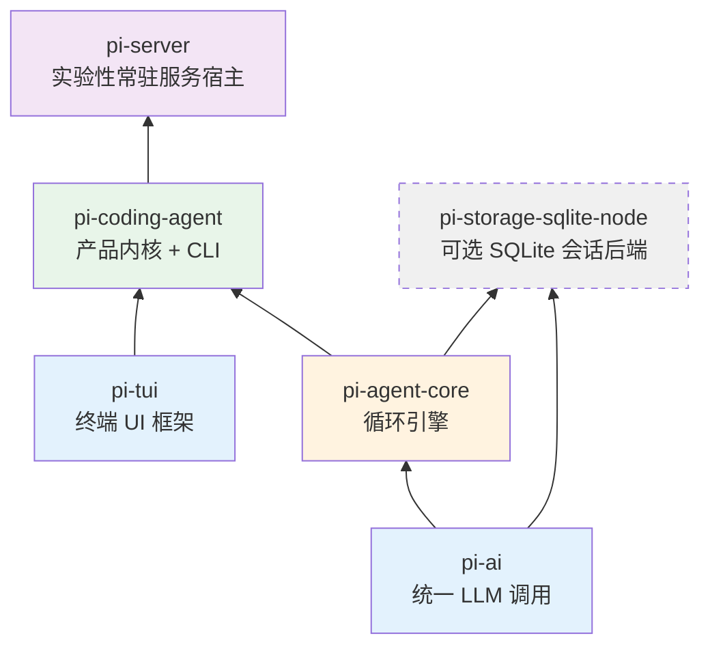
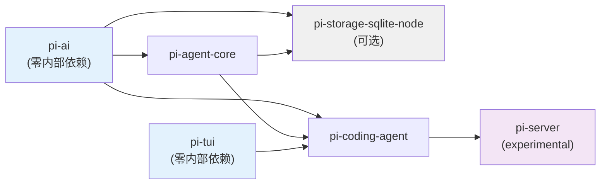

# 第 2 章：包不是项目

> **定位**：本章建立全书最重要的一张分层图。
> 前置依赖：第 1 章。
> 适用场景：当你想快速理解 pi-mono 的全局架构。

## 如何把一个庞大的 agent 系统切成互相不知道对方的层？

pi-mono 是一个 npm workspace monorepo，当前有 7 个 workspace 业务包 — 其中 6 个对外发布，1 个是私有评测包。但它们不是"7 个独立项目"，而是同一个系统里分工不同的层与配件。理解 pi 的架构，第一步就是看清这些分层线怎么切、为什么这么切。

> **关于包数量的演化**：这个 monorepo 的包数从来不是恒定的。它最初只有 3 个包（ai、agent、tui），一度扩张到 7 个（额外有 `pi-mom` Slack bot、`pi (pods)` GPU 编排、`pi-web-ui` Web 组件）；这三者各自分化出独立的使用者与发布节奏后被移出主仓库，收缩回 4 个；此后又长出 `pi-storage-sqlite-node`、`pi-server`、`pi-evals` 三个包，回到 7 个。数量在反复变，判断标准从没变（详见本章末尾「为什么是这些包」一节）。第 27/28/29 章仍保留对三个已迁出包的设计分析，并在章首标注为历史快照。

## Workspace 配置

先看根目录的 `package.json`，它定义了 monorepo 的边界：

```json
// file: package.json:5-13
{
  "workspaces": [
    "packages/*",
    "packages/storage/*",
    "packages/coding-agent/examples/extensions/with-deps",
    "packages/coding-agent/examples/extensions/custom-provider-anthropic",
    "packages/coding-agent/examples/extensions/custom-provider-gitlab-duo",
    "packages/coding-agent/examples/extensions/sandbox",
    "packages/coding-agent/examples/extensions/gondolin"
  ]
}
```

`packages/*` 覆盖了直接放在 `packages/` 下的六个包，`packages/storage/*` 则把嵌套一层的 `packages/storage/sqlite-node` 也纳入 workspace —— 这条 glob 是 v0.81 新增 SQLite 存储后端时补上的，漏了它 sqlite-node 的 `node_modules` 就不会被正确链接。其余的 workspace 入口是 extension 示例项目 — 它们是 extension 的示范实现，同样要参与 npm 的依赖解析。

注意根 `package.json` 的 `"private": true` — 这个 monorepo 本身不发布。7 个业务包里有 6 个发布到 npm（`pi-tui`、`pi-ai`、`pi-agent-core`、`pi-coding-agent`、`pi-storage-sqlite-node`、`pi-server`），只有 `pi-evals` 标了 `"private": true`，作为内部评测 harness 不对外发布。

## 分层图



依赖箭头只向上 — 底层的包不知道上层的存在。`pi-ai` 不知道 `pi-agent-core` 的存在，`pi-agent-core` 不知道 `pi-coding-agent` 的存在。图里两个较新的节点是这条主干上的"配件"和"新楼层"：`pi-storage-sqlite-node`（虚线框）是挂在 `pi-ai` / `pi-agent-core` 侧面的可选会话存储后端，没有任何已发布包依赖它；`pi-server` 则坐在产品层之上、是唯一依赖 `pi-coding-agent` 的包，把 pi 包装成常驻服务，处在分层图的第 5 层。

### 三个较新的包：server、sqlite-node、evals

上一轮收缩到 4 个包之后，仓库又长出三个包。它们的共同点是都没有被塞进 `pi-coding-agent`，因为各自的使用者和发布边界都和产品内核不同。这里只登记定位，展开分析留给后文或未来版本：

**`pi-server`（实验性）**。目录最初以 `orchestrator` 之名落地（commit `7ece19b0`），v0.81.0 改名 `server`（commit `8495f9d0`，#6898）。它把 pi 包装成一个常驻服务：一个 supervisor 监督进程、若干 RPC 子进程、进程间用 IPC 通信，对外提供 HTTP 服务，内部复用 `pi-coding-agent` 的内核（这也是它唯一的运行时依赖）。它的 README 明确标注 **Experimental**，CLI 与 API 都可能变更甚至移除。正因如此，本书**不为 server 单开一章** —— 一个接口尚未稳定的包，架构展开的价值会被后续改动不断稀释；等它稳定下来再补章更划算。

**`pi-storage-sqlite-node`（可选后端）**。基于 Node 内置的 `node:sqlite` 实现的一个 SQLite 会话存储后端（`SqliteSessionRepo` + migrations + 物化视图），供 `pi-agent-core` 的会话持久化选用。它是一个**可选配件**：没有任何已发布包依赖它，当前唯一的使用方是 agent 包里的测试。把它单独成包，正是因为"用 SQLite 存会话"有独立的使用者，又不该强塞进内核。

**`pi-evals`（私有评测）**。基于 `vitest-evals` 的评测 harness（#7085），用 `createHarness` 驱动真实的 `createAgentSession` 跑评测。它标了 `"private": true`，不发布到 npm —— 是内部质量工具，不是对外产品。（顺带一提，evals 曾因沿用改名前的 `@mariozechner/pi-ai` 别名依赖导致发布失败，commit `6173017a` 把它切回直接基于 `vitest-evals` 构建，这是上一轮 scope 迁移遗留的最后一条长尾。）

## 依赖关系的实际验证

每个包的 `package.json` 中的 `dependencies` 字段精确地记录了这些依赖关系。我们可以从源码中直接验证：

**pi-ai**（`@earendil-works/pi-ai`）：零内部依赖。它只依赖外部 SDK — `@anthropic-ai/sdk`、`openai`、`@google/genai`、`@mistralai/mistralai`、`@aws-sdk/client-bedrock-runtime` 等。这是整个系统的最底层。

**pi-agent-core**（`@earendil-works/pi-agent-core`）：唯一的内部依赖是 `pi-ai`。

```json
// file: packages/agent/package.json
{
  "dependencies": {
    "@earendil-works/pi-ai": "^0.82.1"
  }
}
```

极其克制 — 整个循环引擎只有一个内部依赖。

**pi-tui**（`@earendil-works/pi-tui`）：零内部依赖。它只依赖 `chalk`、`marked`、`get-east-asian-width` 等纯 UI 工具库。TUI 框架完全独立于 AI 系统。

**pi-coding-agent**（`@earendil-works/pi-coding-agent`）：依赖三个内部包。

```json
// file: packages/coding-agent/package.json
{
  "dependencies": {
    "@earendil-works/pi-agent-core": "^0.82.1",
    "@earendil-works/pi-ai": "^0.82.1",
    "@earendil-works/pi-tui": "^0.82.1"
  }
}
```

这是依赖最重的包 — 它是三个底层包的汇聚点，把 AI 调用、agent 循环和终端 UI 整合成一个编码助手产品。

两个新包的内部依赖同样遵守"箭头只向上"的原则：`pi-storage-sqlite-node` 依赖 `pi-ai` 与 `pi-agent-core`（同为 `^0.82.1`），`pi-server` 只依赖 `pi-coding-agent`（`^0.82.1`）。所有交叉依赖的版本号都锁在同一个 `^0.82.1` 上，这是下文 lockstep 版本策略的直接结果。

### 依赖关系图（按 direct dependencies 绘制）



这张图的关键特征：没有环。箭头严格从底层指向上层。这不是偶然的 — 它是设计约束。`pi-coding-agent` 仍是产品内核的汇聚点，三个底层包都不知道它的存在；`pi-server` 又在它之上再叠一层，而 `pi-storage-sqlite-node` 是挂在下层旁边的可选分支。整张图依然无环。

## 包的规模与职责

| 包名 | npm 名 | 主要 exports |
|------|--------|-------------|
| pi-ai | `@earendil-works/pi-ai` | `stream()`, Provider Registry, Model 类型 |
| pi-agent-core | `@earendil-works/pi-agent-core` | `agentLoop()`, `Agent`, `AgentHarness`, 类型定义 |
| pi-coding-agent | `@earendil-works/pi-coding-agent` | CLI 入口, Session Manager, 工具集, Extension API, SDK |
| pi-tui | `@earendil-works/pi-tui` | Terminal 渲染引擎, 编辑器组件 |
| pi-storage-sqlite-node | `@earendil-works/pi-storage-sqlite-node` | `SqliteSessionRepo`, SQLite 适配器（可选会话后端）|
| pi-server | `@earendil-works/pi-server`（experimental）| `server` CLI, supervisor, RPC 子进程, IPC / HTTP |
| pi-evals | `@earendil-works/pi-evals`（private）| 评测 harness（`pi-harness.ts`），不发布 |

几个值得关注的数字（数量级以 v0.66 基线为参考，后续版本持续增长）：

**pi-agent-core 只有 5 个源文件、~1,900 行代码**。这是整个 agent 系统的循环引擎。它的极简性不是偶然 — 循环引擎故意只做"循环"这一件事，把所有业务逻辑推给上层。

**pi-coding-agent 有 129 个源文件、~42,100 行代码**。它占了整个项目的近半数代码量。这也是符合预期的 — 产品层需要处理大量具体的工程问题：130+ 个工具实现、会话管理、prompt 组装、extension 加载、配置覆盖等。

**pi-ai 有 ~26,900 行代码**。这些代码的大部分是各 provider 的实现（Anthropic、OpenAI、Google、Bedrock、Mistral 等）和自动生成的模型目录。核心抽象很薄：`models.ts` 的 `Models` 集合与 `Provider` 接口把这一切收拢到一个统一调用面之后（v0.80.0 后旧的 `api-registry.ts` 已删除，详见第 4 章）。

## 每个包的导出策略

pi-mono 中的包在 npm 发布时的导出策略各不相同，反映了它们面向不同使用者的设计意图。

**pi-ai 的多入口导出**。pi-ai 不仅导出主入口（`@earendil-works/pi-ai`），还为每个 provider 提供独立的子路径导出（`@earendil-works/pi-ai/anthropic`、`@earendil-works/pi-ai/openai-responses` 等）。这让使用者可以只导入需要的 provider，避免把所有 provider 的 SDK 都拉进依赖树。OAuth 支持也是独立子路径（`@earendil-works/pi-ai/oauth`）。

**pi-coding-agent 的 hooks 导出**。除了主入口，pi-coding-agent 还导出 `@earendil-works/pi-coding-agent/hooks` — 这是给 extension 开发者用的。Extension 需要引用 hooks 的类型定义，但不应该依赖整个 coding-agent 包的内部实现。单独的子路径导出实现了这种选择性暴露。

**pi-tui 和 pi-agent-core 的单入口导出**。这两个包只有一个导出入口，因为它们的 API 面足够小 — 没有需要独立拆分的子模块。

**bin 字段**。`pi-coding-agent` 导出 `pi` 命令（`"bin": { "pi": "dist/cli.js" }`），`pi-ai` 导出 `pi-ai` 命令，实验性的 `pi-server` 导出 `server` 命令。这些是面向终端用户的入口点。`pi-tui`、`pi-agent-core`、`pi-storage-sqlite-node` 没有 bin — 它们是纯库，不提供 CLI。

## 构建顺序

npm workspace 不保证构建顺序。如果你运行 `npm run build`，npm 会并行构建所有包 — 但包之间有依赖关系，并行构建会失败。

pi-mono 通过在根 `package.json` 的 `build` 脚本中**手动编排构建顺序**来解决这个问题：

```json
// file: package.json:16
{
  "build": "cd packages/tui && npm run build && cd ../ai && npm run build && cd ../agent && npm run build && cd ../storage/sqlite-node && npm run build && cd ../../coding-agent && npm run build && cd ../server && npm run build"
}
```

构建顺序是：`tui` → `ai` → `agent` → `storage/sqlite-node` → `coding-agent` → `server`。随着包数从 4 涨到 7，这条链也从 4 步扩成了 6 步。

这个顺序必须满足一个约束：**每个包在构建时，它所依赖的包必须已经构建完成**。让我们验证：

1. `tui`：零内部依赖，可以最先构建
2. `ai`：零内部依赖，可以最先构建（与 tui 并行也可以）
3. `agent`：依赖 `ai`，必须在 `ai` 之后
4. `storage/sqlite-node`：依赖 `ai` + `agent`，必须排在两者之后
5. `coding-agent`：依赖 `ai` + `agent` + `tui`，必须在三者之后
6. `server`：依赖 `coding-agent`，排在整条链的最后

私有的 `pi-evals` 不参与这条构建链 —— 它不发布、也没有被任何包依赖，跑评测时由根脚本 `npm run eval` 单独驱动。

对于一个内部项目来说，串行构建的简单性和可调试性比省几秒构建时间更有价值。

注意 `pi-ai` 的构建有一个特殊步骤：

```json
// file: packages/ai/package.json:65
{
  "build": "npm run generate-models && npm run generate-image-models && tsgo -p tsconfig.build.json"
}
```

构建前先运行 `generate-models`（和 `generate-image-models`）— 这个脚本从各 provider 的 API 拉取最新的模型目录，生成 `models.generated.ts`（第 18 章详述）。这意味着每次完整构建都会拿到最新的模型列表。

## Lockstep 版本

所有包始终使用同一个版本号（当前 v0.82.1）。每次发布，全部包一起升版；lockstep 覆盖全部 7 个业务包（含私有的 evals）。

**得到了什么**：永远不会有"pi-ai v0.65 和 pi-agent-core v0.66 不兼容"的问题。开发者看到一个版本号就知道整个系统的状态。CI/CD 流程简单 — 一个脚本升版、一个脚本发布。

**放弃了什么**：一个只影响 `pi-tui` 的 bug fix 也要升全部 7 个包。但对于一个内部高度耦合的系统，lockstep 的简单性远胜于独立版本的灵活性。

版本管理通过根目录的脚本完成：

```json
// file: package.json:23-25
{
  "version:patch": "npm version patch -ws --no-git-tag-version && node scripts/sync-versions.js && ...",
  "version:minor": "npm version minor -ws --no-git-tag-version && node scripts/sync-versions.js && ..."
}
```

`npm version patch -ws` 同时升所有 workspace 的版本，`sync-versions.js` 确保交叉依赖中的版本号也同步更新（比如 `pi-agent-core` 的 `dependencies` 中引用的 `@earendil-works/pi-ai` 版本号）。

## 为什么是这些包：一条 3 → 7 → 4 → 7 的曲线

包的数量不是随意的。pi-mono 的包划分遵循一个原则：**当且仅当两段代码有不同的使用者时，它们才应该在不同的包中**。

`pi-ai` 单独成包，因为有人只想用统一 LLM 调用而不需要 agent 循环。`pi-tui` 单独成包，因为终端 UI 框架与 AI 无关 — 它甚至可以用于非 AI 的 TUI 应用。`pi-agent-core` 单独成包，因为有人想用循环引擎构建非编码类 agent。

反过来，`pi-coding-agent` 没有被进一步拆分为 "工具包"、"session 包"、"prompt 包"，因为这些部分没有独立的使用者 — 没有人只要 pi 的工具系统而不要 session 管理。过度拆分只会增加包之间的版本协调成本而没有实际收益。

这个原则解释了包数量**来回的多次变化**。初期 pi-mono 只有 3 个包（ai、agent、tui）；随着 Slack bot、GPU 编排、Web UI 等产品形态的出现，曾扩张到 7 个包（增加了 `pi-mom`、`pi (pods)`、`pi-web-ui`）。但当这三者各自发展出独立的使用者群体、独立的迭代节奏，继续留在主仓库里反而违背了"不同使用者 → 不同包 → 不同仓库"的纪律 —— 于是它们先后被移出为独立项目：`pi-mom` 与 `pi (pods)` 随 commit `0ed0d434`（2026-04-30）移除（mom 的方向性继任为 GitHub `earendil-works/pi-chat`），`pi-web-ui` 随 commit `b141e1fa`（2026-05-20）移除。主仓库收回到聚焦的 4 个包。

收缩之后又是一轮扩张：`pi-storage-sqlite-node`、`pi-server`、`pi-evals` 三个包先后长出来，包数回到 7。关键在于，这一轮扩张用的仍是**同一把尺子**，而不是推翻它 —— 每个新包都对应一群"内核不该背、却确有独立使用者"的代码：想用 SQLite 存会话的人拿到 `pi-storage-sqlite-node` 这个可选后端，想把 pi 跑成常驻服务的人拿到 `pi-server`（尽管它还标着 experimental），需要拿真实 agent 会话跑评测的内部流程拿到 `pi-evals`（它 private，不外发）。三者都没有被塞进 `pi-coding-agent`，因为它们各自的使用者和发布边界都和产品内核不同。曲线从 3 走到 7、退回 4、再回到 7，尺子始终没变。

**移出、加入、再加入，用的是同一把尺子**：代码是否有独立的使用者，以及这个独立性是否强到值得一条独立的发布边界。独立性弱，就留在 `pi-coding-agent` 内部；强到值得单独发布，就成为 `packages/` 下的一个新包；强到需要自己的迭代节奏和仓库，就像 mom / pods / web-ui 那样彻底离开。第 27/28/29 章保留了对这三个已迁出包的设计分析，作为这把尺子的实证案例。

## 取舍分析

### 得到了什么

**强制的分层纪律**。npm 包是硬边界 — 如果 `pi-ai` 试图 import `pi-agent-core` 的代码，TypeScript 编译器会直接报错。这比"团队约定不要跨层调用"强得多。

**独立测试**。每个包有自己的 `vitest` 测试。测试 `pi-agent-core` 时不需要启动任何 UI，测试 `pi-tui` 时不需要配置 API key。

**渐进式采用**。外部开发者可以只使用 `pi-ai`（统一 LLM 调用），不需要引入 agent 引擎；也可以使用 `pi-agent-core`（循环引擎）来构建自己的 agent，不需要依赖 coding agent 的产品层逻辑。

### 放弃了什么

**开发环境复杂度**。每个包意味着一套 `tsconfig.json` 和构建流程。`dev` 脚本需要用 `concurrently` 同时启动多个包的 watch 模式。新贡献者需要理解 monorepo 的工作方式。

**发布流程的原子性要求**。lockstep 版本意味着每次发布必须全部成功或全部回滚。如果某个包的发布失败了，已经发布成功的包也需要处理（虽然实际上各包独立发布到 npm，部分失败时版本号已经消耗掉了）。

---

### 版本演化说明
> 本章核心分析基于 pi-mono v0.66.0，并已对照 v0.82.1（2026 年 7 月）核实。包数量走过
> 一条"3 → 7 → 4 → 7"的曲线：最初 3 个（ai、agent、tui），扩张到 7 个，于 v0.66 之后将
> `pi-mom`、`pi (pods)`（commit `0ed0d434`）与 `pi-web-ui`（commit `b141e1fa`）移出、
> 收回到 4 个，随后又新增 `pi-storage-sqlite-node`、`pi-server`（experimental）、
> `pi-evals`（private）三个包回到 7 个（其中 6 个发布、evals 私有）。构建链相应从 4 步扩为
> 6 步（`tui → ai → agent → storage/sqlite-node → coding-agent → server`），交叉依赖与
> lockstep 版本同步到 `^0.82.1`。npm scope 从 `@mariozechner/` 迁移到 `@earendil-works/`
> （commit `551385e4`/`3e5ad67e`）。分层原则和 lockstep 版本策略从未改变。
