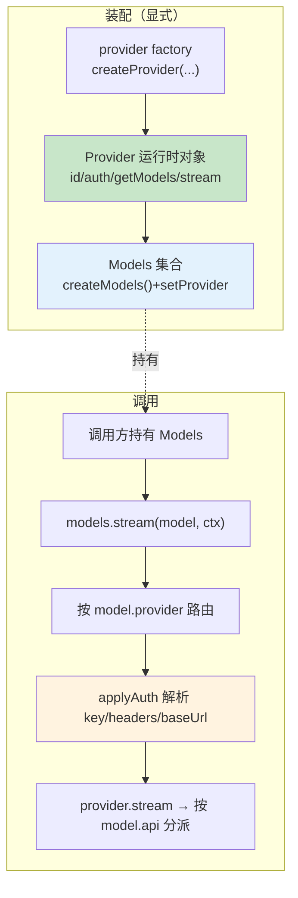

# 第 4 章：Provider 不是 Adapter

> **定位**：本章解剖 pi-ai 的核心抽象 — 如何用一组显式的 `Provider` 运行时单元统一 20+（现约 38）家 LLM 厂商，以及为什么它从早期的全局注册表演化成今天的 `Models` 集合。
> 前置依赖：第 2 章（分层架构）。
> 适用场景：当你想理解如何设计一个多 provider LLM 抽象层，或者想为 pi 添加新的 LLM 供应商。

## 20+ 家厂商，如何用一个接口统一？

这是本章的核心设计问题 — 但它有两个层次。

第一个层次是**抽象**：用什么数据结构描述一次 LLM 调用，才能让 Anthropic、OpenAI、Google、Bedrock 等协议各异的厂商共享同一套调用代码？这个答案（`Model` 值对象 + Provider/Api 双维度）从 pi 诞生至今基本没变。

第二个层次是**装配**：这些 provider 实现如何被组织、被发现、被注入到调用点？这个答案在 v0.80.0 发生了一次全局性的破坏性重构 — 从**隐式的全局副作用注册表**迁移到**显式的 `Models` 依赖注入集合**。这是 pi-ai 这一年里最大的一次架构演进，也是本章的新主线。

我们先讲不变的抽象，再讲变化的装配，最后用一节历史对照说明"为什么当初的注册表要被换掉"。

打开 `packages/ai/src/types.ts`，前 30 行定义了 pi 对 LLM 世界的全部认知：

```typescript
// packages/ai/src/types.ts:16-28

export type KnownApi =
  | "openai-completions"
  | "mistral-conversations"
  | "openai-responses"
  | "azure-openai-responses"
  | "openai-codex-responses"
  | "anthropic-messages"
  | "bedrock-converse-stream"
  | "google-generative-ai"
  | "google-vertex"
  | "pi-messages";

export type Api = KnownApi | (string & {});
```

注意 `Api` 类型的设计：它是 `KnownApi`（已知的 10 种 API 协议）加上 `(string & {})`（任意字符串）的联合。这个看似奇怪的 `(string & {})` 是 TypeScript 的一个技巧 — 它让类型系统对已知值提供自动补全，同时允许任意新值。内建的 10 种协议有 IDE 提示，自定义协议可以用任意字符串注册。

> **版本提示**：v0.71.0 移除了 `google-gemini-cli`（连同 Antigravity 一并删除），一度把 `KnownApi` 降到 9 种；v0.80.8 又新增了 `pi-messages`（Radius 网关使用的原生协议），现为 10 种。

`KnownProvider` 联合列出了约 38 个已知供应商（`types.ts:34-72`，v0.66 时为 23 个，随 DeepSeek、Moonshot、Fireworks、xAI、Kimi Coding、Qwen/Xiaomi Token Plan 等内建化而持续增长）。这里有一处**重要的类型订正**：早期这个联合直接叫 `Provider`，写作 `type Provider = KnownProvider | string`。v0.80.0 起它改名为 `ProviderId`：

```typescript
// packages/ai/src/types.ts:73

export type ProviderId = KnownProvider | string;
```

改名不是美学问题，而是为新架构腾出名字：`Provider`（不带 Id）现在指**运行时的 provider 接口**（`models.ts:75`，本章后面详述），而 `ProviderId` 才是那个"厂商名字符串"的联合类型。凡是 `Model`、`AssistantMessage`、`ToolResultMessage` 上标识"哪个厂商"的字段，类型都是 `ProviderId`，不再是 `Provider`。

这里隐含了 pi 最重要的设计决策之一：**Provider 和 Api 是两个独立的维度**。

一个 provider（比如 `"google"`）可能暴露多种 api（`"google-generative-ai"` 和 `"google-vertex"`）。一种 api 协议（比如 `"openai-responses"`）可能被多个 provider 使用（`"openai"`、`"azure-openai-responses"`、`"github-copilot"`）。如果把 provider 和 api 绑死，每增加一个 Azure OpenAI 部署就要写一个新 provider。分离之后，Azure OpenAI 只需注册一个使用 `"azure-openai-responses"` api 的 provider。

## `Model<TApi>` — 携带一切上下文的值对象

在理解 provider 之前，先看它操作的核心数据：`Model`。

```typescript
// packages/ai/src/types.ts:749-776

export interface Model<TApi extends Api> {
  id: string;
  name: string;
  api: TApi;
  provider: ProviderId;
  baseUrl: string;
  reasoning: boolean;
  thinkingLevelMap?: ThinkingLevelMap;
  input: ("text" | "image")[];
  cost: ModelCost;
  contextWindow: number;
  maxTokens: number;
  headers?: Record<string, string>;
  compat?: /* 基于 TApi 的条件类型 */ ;
}
```

`Model` 不只是一个"模型名称"，它是一个**自描述的值对象**，携带了调用一个 LLM 所需的全部元信息：身份（`id`/`name`/`provider`）、协议（`api`）、能力（`reasoning`/`input`）、约束（`contextWindow`/`maxTokens`）、经济（`cost` 精确到输入/输出/缓存读/缓存写四维）。注意 `provider` 字段的类型是 `ProviderId`，不再是旧稿写的 `Provider`。

### 为什么 Model 是泛型的？

`Model<TApi>` 的泛型参数 `TApi extends Api` 是整个类型系统的支点。它的作用不在于 Model 本身的字段差异（大部分字段对所有 api 都一样），而在于**向下传播协议信息**。

看 `compat` 字段的条件类型（`types.ts:767-775`）：`TApi` 是 `"openai-completions"` 时 `compat` 为 `OpenAICompletionsCompat`；是 `"openai-responses"` 系时为 `OpenAIResponsesCompat`；是 `"anthropic-messages"` 时为 `AnthropicMessagesCompat`；是 `"bedrock-converse-stream"` 时为 `BedrockCompat`；其余为 `never`。这些 compat 类型编码了同一协议下不同厂商的兼容性开关（第 18 章详述）。

更重要的是，`Model<TApi>` 的泛型参数会传递给 `StreamFunction`（`types.ts:311-315`）：

```typescript
export type StreamFunction<
  TApi extends Api = Api,
  TOptions extends StreamOptions = StreamOptions
> = (
  model: Model<TApi>,
  context: Context,
  options?: TOptions,
) => AssistantMessageEventStream;
```

当一个 provider 声明自己的 stream 函数为 `StreamFunction<"anthropic-messages", AnthropicOptions>` 时，TypeScript 保证传入的 `model` 一定是 `Model<"anthropic-messages">`，`options` 一定是 `AnthropicOptions`。每个 provider 的实现在**类型层面就知道自己服务的是哪种协议**，不需要运行时判断。

## `Provider` 是一个运行时单元，不是注册表条目

这里是新架构的枢纽。在旧设计里，"provider" 是全局注册表 Map 里的一个条目 `{ api, stream, streamSimple }` — 一组无状态的函数。在 v0.80.0 之后，`Provider` 是一个**自足的运行时对象**，它自己知道：它是谁、怎么认证、有哪些模型、怎么发起流。

```typescript
// packages/ai/src/models.ts:75-120（节选）

export interface Provider<TApi extends Api = Api> {
  readonly id: string;
  readonly name: string;
  readonly baseUrl?: string;
  readonly headers?: ProviderHeaders;

  /** 至少要有 apiKey / oauth 之一：连纯环境变量、纯本地服务器
   *  这样的 provider 也提供 apiKey 认证，其 resolve() 报告是否已配置。 */
  readonly auth: ProviderAuth;

  /** 当前已知模型（同步）。静态 provider 返回目录；
   *  动态 provider 返回上次 refreshModels() 的结果。不得抛异常。 */
  getModels(): readonly Model<TApi>[];

  /** 仅动态 provider：恢复本地缓存并可选地用凭证拉取更新列表。 */
  refreshModels?(context: RefreshModelsContext): Promise<void>;

  filterModels?(models: readonly Model<TApi>[],
    credential: Credential | undefined): readonly Model<TApi>[];

  stream<T extends TApi>(model: Model<T>, context: Context,
    options?: ApiStreamOptions<T>): AssistantMessageEventStream;
  streamSimple(model: Model<TApi>, context: Context,
    options?: SimpleStreamOptions): AssistantMessageEventStream;
}
```

对比旧的两方法接口（`{ stream, streamSimple }`），新 `Provider` 多出了三组能力：**身份**（`id`/`name`/`baseUrl`/`headers`）、**认证**（`auth: ProviderAuth`，第 7 章展开）、**模型目录**（`getModels`/`refreshModels`/`filterModels`）。这意味着 provider 从"一个 api 协议的实现函数"升级为"一家厂商的完整运行时代表"。api 协议的实现（真正把请求发给 Anthropic 的代码）下沉成了 provider **内部**注入的 `ProviderStreams`，通过 `model.api` 分派。

### `createProvider`：从零件组装一个 provider

没有人手写上面那个接口的每个方法。所有 provider — 内建的和 models.json 里用户自定义的 — 都经由工厂函数 `createProvider` 组装：

```typescript
// packages/ai/src/models.ts:556-623（节选）

export function createProvider<TApi extends Api = Api>(
  input: CreateProviderOptions<TApi>
): Provider<TApi> {
  const baselineModels = input.models;
  let dynamicModels: readonly Model<TApi>[] = [];
  // ... currentModels() 把静态目录与动态覆盖按 id 合并 ...

  const single = typeof (input.api as ProviderStreams).stream === "function"
    ? (input.api as ProviderStreams) : undefined;
  const byApi = single ? undefined
    : (input.api as Partial<Record<string, ProviderStreams>>);
  const apiFor = (model) => single ?? byApi?.[model.api];

  return {
    id: input.id,
    name: input.name ?? input.id,
    baseUrl: input.baseUrl,
    auth: input.auth,
    getModels: currentModels,
    refreshModels: input.fetchModels ? /* 恢复缓存 + 拉取 + 落盘 */ : undefined,
    stream: (model, ctx, opts) =>
      dispatch(model, (s) => s.stream(model, ctx, opts)),
    streamSimple: (model, ctx, opts) =>
      dispatch(model, (s) => s.streamSimple(model, ctx, opts)),
  };
}
```

`createProvider` 的输入 `CreateProviderOptions`（`models.ts:533-548`）就是"一家 provider 的全部配置"：`id`、`auth`、静态 `models` 列表、可选的 `fetchModels`（动态目录）、以及 `api`（单个 `ProviderStreams` 或按 `model.api` 分派的映射表）。它把这些零件组装成上面那个自足对象。

一个真实的 provider factory 只有十几行。以 Anthropic 为例：

```typescript
// packages/ai/src/providers/anthropic.ts:38-50

export function anthropicProvider(): Provider<"anthropic-messages"> {
  return createProvider({
    id: "anthropic",
    name: "Anthropic",
    baseUrl: "https://api.anthropic.com",
    auth: {
      apiKey: anthropicApiKeyAuth(),
      oauth: lazyOAuth({ name: "Anthropic (Claude Pro/Max)",
        load: loadAnthropicOAuth }),
    },
    models: Object.values(ANTHROPIC_MODELS),
    api: anthropicMessagesApi(),
  });
}
```

注意几个设计点：`api: anthropicMessagesApi()` 是一个 **lazy** 的 `ProviderStreams`（真正的 Anthropic SDK 只在第一次流式调用时加载）；`auth.oauth` 用 `lazyOAuth` 包装（OAuth 实现代码在第一次 login/refresh 时才 import）。延迟加载的机制还在，只是从"注册表侧的 `createLazyStream`"下沉到了"每个 factory 内部的 lazy 零件"。

## `Models`：显式的运行时集合

有了自足的 `Provider`，下一个问题是：谁持有这些 provider？谁在调用点把 `model` 派给正确的 provider？答案是 `Models` 集合。

```typescript
// packages/ai/src/models.ts:127-187（节选）

export interface Models {
  getProviders(): readonly Provider[];
  getProvider(id: string): Provider | undefined;
  getModels(provider?: string): readonly Model<Api>[];
  getModel(provider: string, id: string): Model<Api> | undefined;

  refresh(options?: ModelsRefreshOptions): Promise<ModelsRefreshResult>;
  checkAuth(providerId: string): Promise<AuthCheck | undefined>;
  getAvailable(providerId?: string): Promise<readonly Model<Api>[]>;
  getAuth(model: Model<Api>, overrides?): Promise<AuthResult | undefined>;
  login(providerId: string, type: AuthType,
    interaction: AuthInteraction): Promise<Credential>;
  logout(providerId: string): Promise<void>;

  stream<TApi extends Api>(model: Model<TApi>, context: Context,
    options?: ModelsApiStreamOptions<TApi>): AssistantMessageEventStream;
  complete<TApi>(...): Promise<AssistantMessage>;
  streamSimple(...): AssistantMessageEventStream;
  completeSimple(...): Promise<AssistantMessage>;
}
```

`Models` 是一个**接口**，实现是 `ModelsImpl`（`models.ts:218`）。它做四件事：

1. **持有 provider**：内部一个 `Map<string, Provider>`，通过 `MutableModels.setProvider`（`models.ts:191`）增删（`Models` 的可变子接口 `MutableModels` 才暴露 `setProvider`/`deleteProvider`/`clearProviders`）。
2. **路由请求**：`stream(model, ...)` 按 `model.provider` 找到对应 provider，把请求委托给它（`models.ts:489-502`）。
3. **解析认证**：调用 provider 之前，`applyAuth`（`models.ts:463-487`）先经 `getAuth` 解析出 API key / headers / baseUrl，注入到请求选项里再委托。认证从"藏在某个 getApiKey 回调里"变成了集合的一等职责。
4. **刷新目录**：`refresh`（`models.ts:276`）并发刷新所有动态 provider 的模型列表（第 18 章）。

关键在于：**`Models` 是一个值，不是全局单例**。你 `createModels()`（`models.ts:529`）得到一个实例，往里 `setProvider` 你想要的 provider，然后把这个实例作为依赖传给需要它的代码。同一个进程里可以有多个互不干扰的 `Models`（测试尤其受益 — 不再有跨用例泄漏的全局注册表状态）。这就是"隐式全局单例 → 显式依赖注入集合"迁移的核心收益。

`stream` 本身仍是薄委托，只是委托的目标从"全局 Map 查出的函数"变成"集合内按 id 查出的 provider 对象"：

```typescript
// packages/ai/src/models.ts:489-502

stream<TApi extends Api>(model, context, options) {
  return lazyStream(model, async () => {
    const provider = this.requireProvider(model);
    const { requestModel, requestOptions } =
      await this.applyAuth(model, options);
    return provider.stream(requestModel, context, requestOptions);
  });
}
```

## `providers/all.ts`：聚合与 tree-shakeable 拆包

内建 provider 现在集中在 `providers/all.ts`。它导出一个 `builtinProviders()`（`providers/all.ts:87`），返回全部 38 个内建 provider factory 的**新构造实例**；以及 `builtinModels()`（`:131`），一步到位地 `createModels()` 并把它们全部 `setProvider` 进去：

```typescript
// packages/ai/src/providers/all.ts:131-137

export function builtinModels(options?: CreateModelsOptions): MutableModels {
  const models = createModels(options);
  for (const provider of builtinProviders()) {
    models.setProvider(provider);
  }
  return models;
}
```

拆包是这次重构的另一个目标。每个 provider 都在自己的模块里（`providers/anthropic.ts`、`providers/openai.ts`……），API 实现按 api id 命名放在 `api/`（`api/anthropic-messages.ts`、`api/openai-responses.ts`……）。因为 provider 之间不再通过"全局注册表副作用"耦合，一个只用 Anthropic 的下游可以直接 `import { anthropicProvider }`，让打包器 tree-shake 掉其余 37 个 provider 及其 SDK 依赖。旧设计里，只要 `import` 了根入口就会触发 `register-builtins` 的副作用，把所有 provider 的注册代码拖进 bundle。

### 根入口 core-only，旧全局 API 迁到 `/compat`

配合拆包，包的**根入口 `index.ts` 变成了无副作用的 core-only**：只导出类型、`Models`/`createModels`/`createProvider`、auth 类型、事件流工具等，**不导出**生成的模型目录、provider factory、api 实现，也不再有任何"模块加载即注册"的副作用（`index.ts:4-8` 的注释明确写了这一点）。

那些依赖旧全局 API 的代码怎么办？pi 保留了一个**临时兼容入口** `@earendil-works/pi-ai/compat`（源码 `src/compat.ts`）。旧的全局函数 — `stream`/`complete`、`registerApiProvider`/`getApiProvider`/`getApiProviders`/`unregisterApiProviders`、以及 `getModel`/`getModels`/`getProviders` — 都在这里以 `@deprecated` 的形式继续导出。这是一条明确的迁移跑道：老代码改一行 import 就能继续跑，新代码则应当直接用 `Models` 集合。

## 实战：添加一个新 provider 的完整步骤

用一个具体例子走一遍。假设你要添加 DeepSeek，它使用 OpenAI 兼容的 API。

**第一步：确定 Api 协议。** DeepSeek 兼容 OpenAI completions，所以直接复用 `"openai-completions"`，零 api 代码 — 这是 Provider/Api 分离的第一个好处。

**第二步：写一个 provider factory。** 用 `createProvider` 组装：给它 `id: "deepseek"`、`auth`（通常 `envApiKeyAuth("DeepSeek API key", ["DEEPSEEK_API_KEY"])`，见 `auth/helpers.ts:9`）、静态 `models` 列表、以及复用的 `api: openAICompletionsApi()`。

**第三步：注册进集合。** `models.setProvider(deepseekProvider())`；若是内建 provider，则把 factory 加进 `providers/all.ts` 的 `builtinProviders()` 数组。

**第四步：结束。** 用户调用 `models.stream(deepseekModel, context)`，集合按 `model.provider === "deepseek"` 找到 provider，`applyAuth` 解析出 key，provider 内部按 `model.api === "openai-completions"` 分派给复用的实现。

如果 DeepSeek 用的是**完全不兼容**的私有协议，你才需要：在 `KnownApi` 加一个 id（或用任意字符串）、写一个 `ProviderStreams` 实现 `stream`/`streamSimple`、在 factory 的 `api` 字段传入它。即便如此，你**不需要触碰任何"注册表"代码** — 因为已经没有注册表了，只有集合与 factory。核心不变，边缘生长。

## 历史对照：v0.66–v0.79 的全局注册表形态

> 以下机制在 v0.80.0 已被删除，仅作历史对照。它们对应的文件（`api-registry.ts`、`stream.ts`、文本侧 `providers/register-builtins.ts`）在当前源码树中**已不存在**；其公共 API 以 `@deprecated` 形式迁到了 `/compat` 入口。

早期 pi-ai 的枢纽是一个 98 行的 `api-registry.ts`。它维护一个模块级的全局 `Map<string, RegisteredApiProvider>`，公共 API 面只有五个函数：`registerApiProvider`（注册）、`getApiProvider`（查单个）、`getApiProviders`（列全部）、`unregisterApiProviders`（按 `sourceId` 批量注销）、`clearApiProviders`（清空，测试用）。注册时用 `wrapStream` 做一次"类型擦除桥接"：把泛型的 `StreamFunction<TApi, TOptions>` 包装成非泛型函数，在运行时用 `model.api !== api` 检查守住类型边界。这套"入口检查 + 内部擦除"是当时应对"Map 无法表达存在类型"的经典手法。

用户看到的是 `stream.ts`（59 行）导出的 `stream`/`complete`/`streamSimple`/`completeSimple` 四个函数，每个都是"解析 provider + 委托"的一行逻辑。它的第一行 `import "./providers/register-builtins.js"` 是一个**副作用导入** — 模块一加载就执行 `registerBuiltInApiProviders()`，把 9 种内建 provider 灌进全局 Map。每个内建 provider 用 `createLazyStream` 包装：注册时不加载 SDK，第一次调用时才 `import()`，并用 `||=` 缓存 Promise 保证只加载一次。

这套设计当年解决了真问题 — 极简 API 面、Provider/Api 解耦、延迟加载、无限扩展 — 它的很多**设计取舍今天仍然成立**（延迟加载、双方法接口、api 分派都被新架构继承了下来）。但它有两个结构性缺陷，最终促成了 v0.80.0 的重构：

1. **全局可变状态**。注册表是模块级单例。两段代码、两个测试、两个并发的 agent 会话共享同一张表，`sourceId` 批量注销就是为了给这个共享状态打补丁 — 你得记得给每次注册打标签，卸载时按标签清理。这是"全局单例"必然要付的税。
2. **副作用耦合阻碍 tree-shaking**。"import 根入口 = 注册所有内建 provider"意味着任何下游都无法只带走它用的那一家。

新架构用"值语义的集合"替换了"全局的表"：provider 变成自足对象，集合变成可传递的依赖，`sourceId` 批量注销退化为"从你自己的集合里 `deleteProvider`"，副作用注册退化为"显式 `setProvider`"。同一套延迟加载、同一套 api 分派，换了一个装配底座。

## 取舍分析

### 得到了什么

**1. 消除全局可变状态**。`Models` 是值不是单例。测试之间不再泄漏注册状态，多会话可以各持一个集合，认证/凭证也随集合隔离。

**2. 真正的 tree-shaking**。core-only 的根入口 + 每 provider 独立模块，让下游只打包用到的 provider。旧的"副作用注册"被"显式装配"取代。

**3. Provider 升级为完整运行时单元**。认证、模型目录、动态刷新都内聚在 provider 自身，而不是散落在注册表、OAuth 注册表、model-registry 三处。`Models` 只负责路由与 auth 应用。

**4. 抽象层的取舍被继承**。Provider/Api 解耦、双方法接口（`stream`/`streamSimple`）、延迟加载 — 这些旧设计的优点一个没丢，只是换了装配方式。

### 放弃了什么

**1. 一次破坏性迁移的成本**。所有依赖 `stream()`/`registerApiProvider()` 全局函数的下游都必须迁移。`/compat` 入口把成本摊薄成"改 import"，但它是**临时**的，最终仍要清账。

**2. 显式装配的样板**。旧代码 `import "pi-ai"` 就能 `stream(model)`；新代码要先 `builtinModels()` 或手动 `createModels()+setProvider()`，再 `models.stream(model)`。多了一步"谁持有集合、集合怎么传下去"的显式接线 — 这正是依赖注入相对于全局单例的固有代价，也是它的全部意义。

**3. 运行时才知道 provider 是否可用**。这一点两代架构相同：provider 是运行时装配的，配了一个未注册的 provider，错误只在调用时暴露（`requireProvider` 抛 `Unknown provider`）。

对于 pi 的定位 — 支持 38+ 家厂商、允许用户扩展、要被多个宿主（TUI/SDK/RPC）以库的形式复用 — 显式集合是比全局注册表更合适的底座。它用一点装配样板，买到了可测试性、可 tree-shake、以及"provider 是一等运行时对象"的内聚性。



---

### 版本演化说明
> 本章内容已对照 pi-mono **v0.82.1**。本章主线在 **v0.80.0** 跨过了一道破坏性分界：
> - **v0.80.0（Breaking）**：删除全局 `api-registry.ts`/`stream.ts`/文本侧 `register-builtins.ts`，代之以 `Provider` 运行时接口（`models.ts:75`）、`createProvider`（`:556`）、`Models`/`createModels`（`:127`/`:529`）与 `providers/all.ts` 聚合。旧全局 API（`stream`/`registerApiProvider`/`getApiProvider`/`unregisterApiProviders` 等）迁到 `@earendil-works/pi-ai/compat` 临时入口；根 `index.ts` 变为无副作用 core-only。
> - **类型订正**：`Provider` 联合类型改名 `ProviderId`（`types.ts:73`）；`Provider` 现指运行时接口。`Model.provider`、`AssistantMessage.provider` 等字段类型为 `ProviderId`。
> - **计数**：`KnownApi` 现为 10 种（v0.80.8 新增 `pi-messages`）；`KnownProvider` 约 38 种。
> 早期（v0.66–v0.79）的注册表叙述见上文"历史对照"节；其延迟加载、双方法接口、Provider/Api 解耦等取舍被新架构继承。
