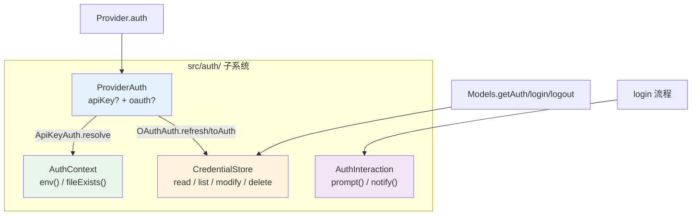

# 第 7 章：认证是一等子系统

> **定位**：本章解析为什么 pi 把认证从"一组 OAuth 工具函数"升级为与 provider 对等的一等子系统 `src/auth/`，以及它如何用四个抽象统一 API key、OAuth、环境变量、AWS profile 等所有凭证来源。
> 前置依赖：第 4 章（Provider 与 Models 集合）。
> 适用场景：当你想理解为什么认证不能推到产品层，或者想为 pi 添加新的认证方式 / OAuth provider。

## 认证为什么值得成为一等子系统？

这是本章的核心设计问题。

直觉上，认证应该是产品层的事：用户登录，拿到 token，传给 LLM 调用层。但 pi 不仅把认证放在 pi-ai 层，还把它从"一堆 `utils/oauth/` 工具函数"重构成了一个**独立成层的子系统** `packages/ai/src/auth/`，与 provider 注册、事件流并列。这次重构分两步落地：v0.80.0 引入 auth substrate（`ProviderAuth` / `CredentialStore` / 双检刷新），v0.80.8 完成收口（删除旧的全局 OAuth 注册表、把六回调的 `AuthLoginCallbacks` 改名收敛为 `AuthInteraction`、`checkAuth`/`getAuth`/`login`/`logout` 运行时入口收口）。为什么值得这样投入？

原因是三个约束叠加在一起，任何一个单独看都不足以成层，合在一起就必须成层：

1. **凭证会过期，而 agent 的一次 run 可能持续几十分钟。** OAuth token 在第 7 次 LLM 调用时过期，谁负责刷新？如果认证在产品层，产品层得在每次调用前检查并刷新 — 但产品层不知道循环引擎何时发起调用。刷新必须下沉到调用点附近。
2. **凭证来源五花八门，但调用点只想要"一个 key"。** 同一个 provider 的凭证可能来自：存储的 API key、存储的 OAuth token、环境变量、AWS profile、ADC 文件、bearer 网关 token。调用点不该关心这些差异，它只想拿到一份可用的请求认证。
3. **刷新必须是并发安全的。** 几十分钟里多个并发请求可能同时发现 token 过期，如果各自去刷新，会互相作废对方刚换来的 token。刷新需要一把跨请求（甚至跨进程）的锁。

把"过期刷新 + 来源归一 + 并发安全"这三件事内聚成一层，让 provider 和调用点都不必操心，这就是认证成为一等子系统的理由。旧的 `utils/oauth/` 只解决了 OAuth 一种来源，无法承载后两个约束 — 这是它被重构掉的根本原因。

## 认证子系统的四个抽象

`src/auth/` 用四个正交的抽象搭起整个子系统。理解了它们的分工，就理解了这一层：



- **`ProviderAuth`**（`auth/types.ts:217`）— 一个 provider 的认证能力声明，只有两个字段：`apiKey?: ApiKeyAuth` 和 `oauth?: OAuthAuth`，至少有其一。
- **`CredentialStore`**（`auth/types.ts:60`）— app 拥有的凭证存储，按 provider id 存一份凭证，`modify` 是唯一写路径。
- **`AuthContext`**（`auth/types.ts:91`）— 环境访问的注入点（`env(name)` / `fileExists(path)`），让 auth 解析在测试和浏览器里可替换。
- **`AuthInteraction`**（`auth/types.ts:150`）— 登录流程与用户交互的抽象，只有 `prompt()` 和 `notify()` 两个方法。

下面逐个展开最关键的三个。

## `ProviderAuth`：一个 provider 的两条认证腿

```typescript
// packages/ai/src/auth/types.ts:217-220

export interface ProviderAuth {
  apiKey?: ApiKeyAuth;
  oauth?: OAuthAuth;
}
```

设计上强制"至少有其一"：**每个 provider 都有认证语义**，哪怕它只靠环境变量、AWS profile，甚至是无 key 的本地服务器 — 这类 provider 也提供一个 `apiKey` 认证，其 `resolve()` 负责报告"这个 provider 到底配没配好"。这是一个重要的统一：`Models.getAuth()` 对未配置的 provider 一律返回 `undefined`，调用点不需要区分"这个 provider 用 key 还是用 OAuth"。

`ApiKeyAuth`（`auth/types.ts:161`）有三个方法：可选的 `login`（交互式录入 key）、可选的 `check`（无副作用的可用性探测）、必需的 `resolve`（从存储凭证 + 环境来源逐字段解析出请求认证）。绝大多数 provider 的 `ApiKeyAuth` 都由一个 helper 一行生成：

```typescript
// packages/ai/src/auth/helpers.ts:9-27（节选）

export function envApiKeyAuth(name: string, envVars: readonly string[]): ApiKeyAuth {
  return {
    name,
    login: async (interaction) => ({
      type: "api_key",
      key: await interaction.prompt({ type: "secret", message: `Enter ${name}` }),
    }),
    resolve: async ({ ctx, credential }) => {
      if (credential?.key) return { auth: { apiKey: credential.key }, ... };
      for (const envVar of envVars) {
        const value = await ctx.env(envVar);
        if (value) return { auth: { apiKey: value }, source: envVar };
      }
      return undefined;
    },
  };
}
```

`resolve` 的逻辑是"存储凭证优先，否则按顺序试环境变量"。有非标准来源的 provider（Anthropic 支持 bearer 网关 token、Bedrock 走 AWS profile、Google 走 ADC 文件）自己写 `ApiKeyAuth`，但接口不变 — 调用点永远只调 `resolve`。

## `OAuthAuth`：`refresh` / `toAuth` 的职责切分

OAuth 认证是 `ProviderAuth` 的另一条腿。它的接口设计里藏着这次重构最关键的一个决策：

```typescript
// packages/ai/src/auth/types.ts:189-210

export interface OAuthAuth {
  name: string;
  loginLabel?: string;

  login(interaction: AuthInteraction): Promise<OAuthCredential>;

  /** 交换 refresh token。网络调用，失败即抛（invalid_grant 等）。
   *  Models 在 store 锁下运行它。 */
  refresh(credential: OAuthCredential, signal?: AbortSignal): Promise<OAuthCredential>;

  /** 无副作用地从一个有效凭证派生请求认证。
   *  覆盖 per-credential baseUrl（GitHub Copilot）。 */
  toAuth(credential: OAuthCredential): Promise<ModelAuth>;
}
```

关键是把 `refresh` 和 `toAuth` **拆成两个方法**：

- **`refresh`** 是"有副作用、要网络、会失败"的那一半 — 拿 refresh token 换一个新的 credential。
- **`toAuth`** 是"无副作用、纯派生"的那一半 — 从**已经有效**的 credential 派生出这次请求要用的 `ModelAuth`（apiKey / headers / baseUrl）。

为什么拆开？因为这让 `Models` 能够**独占并封装"加锁刷新"这套并发控制**。刷新是全局串行的（要在 store 锁下、双检过期、只刷一次），而派生是每次请求都要做、且可以随便并发的。如果把它们揉进一个方法，`Models` 就无法在正确的粒度上加锁。拆开之后，`Models` 的算法变得干净：过期就在锁下 `refresh` 一次，然后无论如何都 `toAuth` 派生。

GitHub Copilot 是 `toAuth` 派生能力的最佳例子。Copilot 不允许直连 OpenAI，请求必须发到嵌在 token 里的代理地址。旧架构靠一个 `modifyModels` 回调批量改写模型的 `baseUrl`；新架构把它收进 `toAuth`：

```typescript
// packages/ai/src/auth/oauth/github-copilot.ts:373-378

async toAuth(credential) {
  return {
    apiKey: credential.access,
    baseUrl: getGitHubCopilotBaseUrl(credential.access,
      copilotEnterpriseDomain(credential)),
  };
}
```

`baseUrl` 从 token 的 `proxy-ep` 字段解析而来，每次 `toAuth` 用最新的 credential 重新派生。这比"登录后一次性改写模型列表"更准确 — baseUrl 跟着 credential 走，token 一旦刷新，下次 `toAuth` 自动拿到新地址。

## `CredentialStore`：`modify` 作为唯一写路径

凭证存储的接口把"并发安全"设计进了类型：

```typescript
// packages/ai/src/auth/types.ts:60-88（节选）

export interface CredentialStore {
  read(providerId: string): Promise<Credential | undefined>;
  list(): Promise<readonly CredentialInfo[]>;
  modify(providerId: string,
    fn: (current: Credential | undefined) => Promise<Credential | undefined>,
  ): Promise<Credential | undefined>;
  delete(providerId: string): Promise<void>;
}
```

注意**没有 `write`**。唯一的写路径是 `modify` — 一个串行化的 read-modify-write：`fn` 能看到当前凭证，返回新凭证或 `undefined`（表示不变）。为什么强制走 `modify`？因为正确的写入都依赖当前值：刷新要先看"是不是真过期了"、登录要看"是不是别人刚登录过"。`modify` 对每个 provider id 提供互斥（后端支持时甚至跨进程，如文件锁），保证这些 read-modify-write 不会交错。

`list()` 则明确要求"不解析、不暴露 secret、不执行配置的 API-key 命令" — 它只列出凭证的元数据（provider id + 类型），供账户/状态 UI 枚举。读与列的分离，避免了状态页面无意中触发一串命令执行或 token 刷新。

### store 锁下的双检过期刷新

把 `OAuthAuth.refresh` / `toAuth` 的切分和 `CredentialStore.modify` 的串行化合起来，就得到了 `resolveProviderAuth` 里那段"双检锁定"的刷新逻辑：

```typescript
// packages/ai/src/auth/resolve.ts:101-123（节选）

if (Date.now() >= credential.expires) {
  // 乐观检查说过期了；权威检查在锁内进行
  const post = await credentials.modify(providerId, async (current) => {
    if (current?.type !== "oauth") return undefined;       // 期间登出了
    if (Date.now() < current.expires) return undefined;    // 别的请求已刷新
    try {
      return await oauth.refresh(current);
    } catch (error) {
      throw new ModelsError("oauth", `OAuth refresh failed for ${providerId}`, { cause: error });
    }
  });
  if (post?.type !== "oauth") return undefined;
  credential = post;
}
return { auth: await oauth.toAuth(credential), source: "OAuth" };
```

有效 token 走零锁的快路径（`Date.now() < expires` 直接 `toAuth`）；过期 token 才进 `modify` 锁，**在锁内再检一次过期**（别的请求可能刚刷过），确认仍过期才 `refresh` 一次，落盘后释放。这正是"存储型凭证独占 provider"的语义（`resolve.ts:40-45` 注释）：一旦存了凭证，就以它为准，刷新失败也**不静默回退到环境变量** — 因为静默回退会掩盖"你需要重新登录"这个事实。

## 接口收敛：六回调 → `prompt()` / `notify()`

登录流程要和用户交互 — 打开浏览器、显示设备码、等待输入、让用户选择。但 OAuth provider 不该知道自己跑在终端、Electron 还是 Slack bot 里。旧架构用一个有**六个回调**的 `OAuthLoginCallbacks` 抽象这层交互（`onAuth`、`onDeviceCode`、`onPrompt`、`onSelect`、`onProgress`、`onManualCodeInput`）。新架构把它收敛成**两个方法**：

```typescript
// packages/ai/src/auth/types.ts:150-155

export interface AuthInteraction {
  signal?: AbortSignal;
  prompt(prompt: AuthPrompt): Promise<string>;
  notify(event: AuthEvent): void;
}
```

收敛的关键洞察是：那六个回调其实只有两类语义 — 要么**向用户要一个输入并等待返回值**，要么**向用户单向通知一件事**。于是：

- **`prompt(AuthPrompt)`** 吸收了 `onPrompt` / `onSelect` / `onManualCodeInput`。`AuthPrompt`（`auth/types.ts:119`）是一个带 `type` 的联合：`text` / `secret` / `select` / `manual_code`。`select` 返回选项 id，其余返回输入的字符串。
- **`notify(AuthEvent)`** 吸收了 `onAuth` / `onDeviceCode` / `onProgress`。`AuthEvent`（`auth/types.ts:131`）也是一个联合：`info` / `auth_url` / `device_code` / `progress`。

**这是一个典型的接口收敛取舍。** 得到了什么：宿主实现从"填六个具名回调"变成"写两个方法 + 两个 switch"，新增一种交互（比如未来的 passkey 流程）只需给 `AuthPrompt` / `AuthEvent` 联合加一个分支，而**不用改 `AuthInteraction` 接口本身**；同时这套接口同时服务 api-key 和 OAuth 两种登录，不再是 OAuth 专属。放弃了什么：具名回调的"自文档性" — `onDeviceCode` 一看就知道是设备码，而 `notify({ type: "device_code", ... })` 要读联合定义才知道有哪些事件；此外宿主必须处理联合里所有分支（漏了一个 `type` 就是运行时的"未知交互"）。对 pi 这种交互种类会持续增长的场景，用"数据驱动的联合"换"接口稳定性"是划算的 — 这正是把可变性从**接口形状**挪到**数据形状**的经典手法。

## PKCE：为什么 CLI 应用不能有 client secret

登录流程本身（PKCE、本地回调、device-code）的机制没有随重构改变，只是交互从六回调换成了 `notify`/`prompt`。这里保留核心的 PKCE 原理。

传统 OAuth 依赖 client secret 证明身份。但 CLI 发布到用户机器上，任何人都能反编译出 secret。PKCE（RFC 7636）用一次性密码学证明替代 client secret：

```typescript
// packages/ai/src/auth/oauth/pkce.ts:21-34（简化）

export async function generatePKCE(): Promise<{ verifier: string; challenge: string }> {
  const verifierBytes = new Uint8Array(32);
  crypto.getRandomValues(verifierBytes);
  const verifier = base64urlEncode(verifierBytes);

  const data = new TextEncoder().encode(verifier);
  const hashBuffer = await crypto.subtle.digest("SHA-256", data);
  const challenge = base64urlEncode(new Uint8Array(hashBuffer));
  return { verifier, challenge };
}
```

发起授权时把 `challenge`（verifier 的 SHA-256）放进 URL；交换 token 时把原始 `verifier` 发给 token endpoint，服务端做 SHA-256 比对。安全性建立在"即使截获 `challenge` 也无法反推 `verifier`"上，而 `verifier` 只在本进程内存里存在。代码用 Web Crypto API 而非 Node.js `crypto` 模块，让它在 Node 20+ 和浏览器里都能跑。

## Anthropic 登录：三层降级与 `AuthInteraction`

以 Anthropic 为例看完整流程如何落到 `notify`/`prompt` 上：

```mermaid
sequenceDiagram
    participant User as 用户终端
    participant CLI as pi CLI
    participant Server as 本地 HTTP 服务器<br/>127.0.0.1:53692
    participant Claude as claude.ai

    CLI->>CLI: generatePKCE() → {verifier, challenge}
    CLI->>Server: startCallbackServer(verifier)
    CLI->>User: notify({type:"auth_url", url}) — 打开浏览器
    alt 本地回调成功
        Claude->>Server: GET /callback?code=xxx&state=yyy
    else 手动粘贴（SSH 等远程场景）
        User->>CLI: prompt({type:"manual_code"}) — 粘贴 URL
    end
    CLI->>CLI: notify({type:"progress", ...}); 交换 token
    CLI->>CLI: 返回 OAuthCredential（Models 落盘）
```

`loginAnthropic`（`auth/oauth/anthropic.ts:229`）先 `generatePKCE()` 并在 `127.0.0.1:53692` 启一个回调服务器（回调主机可经 `PI_OAUTH_CALLBACK_HOST` 配置，端口固定，`anthropic.ts:32-33`），然后 `interaction.notify({ type: "auth_url", url })` 让宿主打开浏览器。接着是三层降级：**本地回调**（同机浏览器命中 `/callback`）→ **手动粘贴**（`interaction.prompt({ type: "manual_code" })`，SSH 远程场景）→ 竞赛，谁先拿到 code 用谁。交换 token 时 `notify({ type: "progress", ... })` 报告进度。整个 provider 不知道自己在什么宿主里，只调这两个方法。

`login` 返回的 `OAuthCredential` 由 `Models.login()` 负责落盘。过期时间处理仍是"提前 5 分钟标记过期"（`anthropic.ts:338`：`expires_in * 1000 - 5 * 60 * 1000`），留出刷新窗口，消除"请求发出后、响应返回前 token 过期"的竞态。

### 三种登录范式，一套交互协议

pi 同时支持三种登录范式，全部共享 `AuthInteraction`：**PKCE + 本地回调**（Anthropic）、**device-code 轮询**（GitHub Copilot 一直用、OpenAI Codex 作无头替代，共享 `auth/oauth/device-code.ts`）、以及二者的**手动粘贴降级**。宿主只要实现 `prompt`/`notify` 两个方法，三种范式都能跑。

内建 OAuth provider 也从早期的 3 家扩展到多家。当前文本侧提供 OAuth 的 provider 有 **7 家**（各自的 factory 在 `providers/*.ts` 里用 `lazyOAuth` 声明，实现在 `auth/oauth/*.ts`）：

| Provider | OAuth 显示名 | 登录范式 |
|----------|-------------|---------|
| anthropic | Anthropic (Claude Pro/Max) | PKCE + 本地回调 |
| github-copilot | GitHub Copilot | device-code |
| openai-codex | OpenAI (ChatGPT Plus/Pro) | 浏览器 / device-code |
| xai | xAI (Grok/X subscription) | device-code |
| kimi-coding | Kimi Code (subscription) | device-code |
| openrouter | OpenRouter OAuth | PKCE |
| radius | （随网关名） | device-code / PKCE |

## 运行时入口：provider-scoped 的四个方法

调用点不直接碰上面的抽象，而是通过 `Models` 集合上四个 provider-scoped 的方法使用认证（第 4 章）：

- **`Models.checkAuth(providerId)`**（`models.ts:388`）— 无副作用地检查一个 provider 是否配好认证（不刷新 OAuth），供状态 UI 用。
- **`Models.getAuth(model | providerId)`**（`models.ts:413`）— 解析出这次请求的 `AuthResult`（apiKey/headers/baseUrl + source 标签）。请求路径（`stream`）内部就调它，过期 OAuth 在这里被透明刷新。
- **`Models.login(providerId, type, interaction)`**（`models.ts:431`）— 跑 provider 自己的登录流程并把返回的 credential 落盘。
- **`Models.logout(providerId)`**（`models.ts:447`）— 删除存储的 credential。

对循环引擎（第 8 章）来说，认证依然是透明的：它调 `models.stream(model, ...)`，`applyAuth`（`models.ts:463`）在内部完成"解析 + 刷新 + 注入 header/baseUrl"。区别在于，这个透明性现在由 `Models` 集合 + `auth/` 子系统共同提供，而不是旧的"藏在 `getApiKey` 回调里的一个 OAuth 工具函数"。

## 错误信息策略：从"统一简化"反转为"保留底层 cause"

这里要**订正**上一版书稿的一个取舍判断。旧的 `getOAuthApiKey` 把所有刷新错误统一成 `Failed to refresh OAuth token for ${providerId}`，**丢弃原始错误信息**，当时把它描述为"有意的信息损失，简化上层处理"。新架构的策略**反转了**：`ModelsError` 现在会把底层 cause 追加进消息：

```typescript
// packages/ai/src/auth/resolve.ts:22-38

export class ModelsError extends Error {
  readonly code: ModelsErrorCode;
  constructor(code: ModelsErrorCode, message: string, options?: { cause?: unknown }) {
    super(withCauseDetail(message, options?.cause), options);
    this.name = "ModelsError";
    this.code = code;
  }
}

/** Callers surface `error.message` only, so keep the underlying reason in it. */
function withCauseDetail(message: string, cause: unknown): string {
  if (cause === undefined || cause === null) return message;
  const detail = formatThrownValue(cause).trim();
  if (!detail || message.includes(detail)) return message;
  return `${message}: ${detail}`;
}
```

`ModelsError` 用一个 `code`（`"oauth"` / `"auth"` / `"provider"` / `"stream"` / `"model_source"` / `"model_validation"`）做机器可分类的错误，同时 `withCauseDetail` 把底层原因拼进 `message`。反转的理由写在注释里：**调用方只会展示 `error.message`**，所以底层原因必须留在 message 里，否则用户看到的永远是"刷新失败了"却不知道是网络超时、refresh token 过期还是服务端拒绝。旧策略优化了"上层代码的简单"，新策略优化了"用户和调试者能看到真相" — 对一个凭证问题高频、且失败后需要用户自己判断"是重新登录还是检查网络"的系统，后者显然更重要。同时 `code` 字段保证了需要分类处理时仍可用 `error.code === "oauth"` 判断，鱼与熊掌兼得。

## 历史对照：v0.66–v0.79 的 OAuth 注册表

> 以下机制在 v0.80.8 已被删除或重写，仅作历史对照。`utils/oauth/` 目录、`OAuthProviderInterface`、全局 `oauthProviderRegistry`、`getOAuthApiKey`、六回调的 `OAuthLoginCallbacks` 在当前源码树中已不存在（其扩展兼容类型残留在 `compat/extension-oauth-types.ts`）。

早期认证是 `packages/ai/src/utils/oauth/` 下的一组工具函数，核心是一个 `OAuthProviderInterface`（`id`/`name`/`login`/`refreshToken`/`getApiKey`/可选 `modifyModels`）和一个与 API provider 注册表同构的**全局 OAuth 注册表** `oauthProviderRegistry`（`registerOAuthProvider` / `unregisterOAuthProvider`，卸载内建 provider 时"恢复默认"而非删除）。运行时靠一个 `getOAuthApiKey(providerId, credentials)` 函数：查注册表、判断过期、调 `refreshToken`、`getApiKey` 提取 key，失败则统一简化错误。交互靠六回调的 `OAuthLoginCallbacks`。

这套设计在当时是自洽的，也解决了真问题（三种 OAuth 流程共享一套 UI 协议、extension 可注册新 provider）。但它有几个结构性局限，最终促成 v0.80.0–v0.80.8 的重写（v0.80.0 引入新 substrate、v0.80.8 删除旧注册表完成收口）：

1. **只覆盖 OAuth 一种来源**。API key、环境变量、AWS profile、ADC 文件各有各的处理路径，没有一个统一的"解析这个 provider 的认证"入口。新的 `ProviderAuth` 把 apiKey 和 oauth 收进同一个抽象。
2. **全局注册表 = 全局可变状态**。和第 4 章的 API 注册表一样，它是模块级单例，`unregisterOAuthProvider` 的"恢复默认"就是给共享状态打的补丁。新架构里 OAuth 下沉为每个 `Provider.auth.oauth`，随 provider 装配进集合，没有全局表。
3. **`refresh` 和"取 key"揉在一起**。`getApiKey(credentials)` 既可能触发刷新又要派生 key，`Models` 无法在正确粒度加锁。新的 `refresh`/`toAuth` 切分解决了这个问题。
4. **错误信息被统一丢弃**（见上节），且 `modifyModels` 用"批量改写模型列表"来表达"per-credential baseUrl"，绕了远路。新架构用 `toAuth` 直接派生 baseUrl。

## 取舍分析

### 得到了什么

**1. 凭证来源被统一。** API key、OAuth、环境变量、AWS profile、bearer 网关全部收敛到 `ProviderAuth.resolve` / `getAuth` 一个入口，调用点只拿"一份可用认证"。

**2. 并发安全内建。** `CredentialStore.modify` 唯一写路径 + `refresh`/`toAuth` 切分 = store 锁下的双检刷新，多请求/多进程不会互相作废 token。

**3. 认证与 provider 对等内聚。** OAuth 随 provider 装配，不再有全局 OAuth 注册表；`Models` 提供 provider-scoped 的 `checkAuth`/`getAuth`/`login`/`logout`。

**4. 接口对增长友好。** 交互收敛为 `prompt`/`notify` 两方法，新增交互种类只加联合分支；错误保留底层 cause 同时保留可分类的 `code`。

### 放弃了什么

**1. 一次破坏性重构的成本。** 依赖 `getOAuthApiKey`、`OAuthLoginCallbacks`、`registerOAuthProvider` 的下游都要迁移到 `auth/` 子系统。

**2. ai 层的职责进一步扩大。** 一个"LLM 调用抽象层"如今还独立管一整层认证。但如本章开头所述，过期刷新、来源归一、并发安全这三个约束把认证和调用紧紧绑在一起，分到不同层反而要跨层协调。

**3. 凭证持久化仍不在 ai 层。** `CredentialStore` 是接口，真正的落盘（文件、keychain）由产品层实现。ai 层只定义"怎么用、怎么并发安全地改"，不定义"存在哪"。

**4. 交互联合的自文档性下降。** 具名回调换成 `type` 联合，宿主必须读联合定义并处理所有分支。这是接口收敛的固有代价。

对 pi 的定位 — 支持几十家 provider、多种订阅制 OAuth、要在容器/SSH/桌面等各种环境登录 — 把认证做成一等子系统是值得的。它用一层抽象的投入，换来了凭证来源的统一、并发刷新的正确性，以及"认证是 provider 的对等能力"这个更清晰的心智模型。

---

### 版本演化说明
> 本章内容已对照 pi-mono **v0.82.1**。本章主线分两步跨过了一道破坏性分界（v0.80.0 引入、v0.80.8 收口）：
> - **v0.80.0（引入 auth substrate）**：把认证从 `utils/oauth/` 抽成独立的认证子系统 `src/auth/`，落地 `ProviderAuth`（`auth/types.ts:217`）、`CredentialStore`（`:60`）、`AuthContext`、`OAuthAuth`（`login`/`refresh`/`toAuth`，`:189`），以及 store 锁下的双检过期刷新。
> - **v0.80.8（Breaking，完成收口）**：删除旧的全局 OAuth 注册表 `oauthProviderRegistry`（`register/unregisterOAuthProvider`）、`OAuthProviderInterface`、`getOAuthApiKey`；把六回调的 `AuthLoginCallbacks` 改名收敛为 `AuthInteraction` 的 `prompt()`/`notify()`（`auth/types.ts:150`）；运行时入口收口为 provider-scoped 的 `Models.checkAuth()`/`getAuth()`/`login()`/`logout()`。
> - **内建 OAuth provider 扩展**：从 3 家扩到 7 家（+xAI、Kimi Coding、OpenRouter、Radius）。
> - **v0.82.1**：`ANTHROPIC_AUTH_TOKEN` bearer 网关支持（`providers/anthropic.ts:21-27`）；`ModelsError` 追加底层 cause（`auth/resolve.ts:22-45`）— 上一版书稿"刷新错误被统一简化、丢弃原始信息"的取舍**已反转**，见本章"错误信息策略"节。
> 早期（v0.66–v0.79）的 OAuth 注册表叙述见"历史对照"节；PKCE、三层降级、device-code 等登录范式被新架构继承，只是交互从六回调换成了 `prompt`/`notify`。
