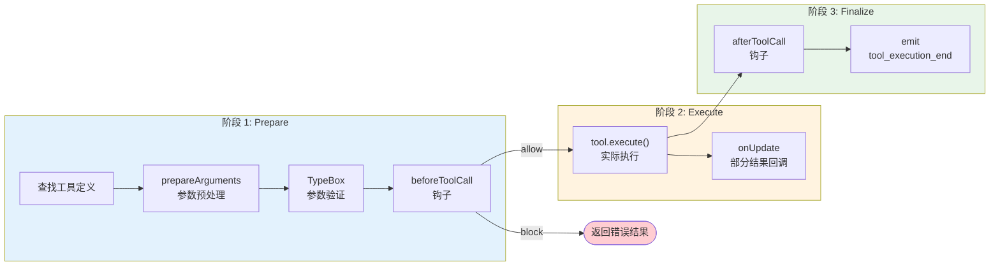

# 第 9 章：工具执行不是插件调用

> **定位**：本章解剖循环引擎中工具执行管道的三阶段设计。
> 前置依赖：第 8 章（agentLoop 双层循环）。
> 适用场景：当你想理解 pi 如何让工具调用既安全又灵活，或者想为自己的 agent 系统设计工具执行策略。

## 为什么工具调用不能简单地"调一下"？

上一章展示了 `runLoop()` 如何在内层循环中调用 `executeToolCalls()`。那个调用看起来只是一行代码：

```typescript
const batch = await executeToolCalls(
  currentContext, message, config, signal, emit
);
// batch.messages: ToolResultMessage[]（按 LLM 源顺序排列）
// batch.terminate: 整批是否请求 agent 停止（见第 8 章）
```

（v0.69.0 起 `executeToolCalls` 的返回类型从裸 `ToolResultMessage[]` 变成 `{ messages, terminate }`，`terminate` 喂给上一章的内层续轮判断。）

但如果展开 `executeToolCalls()`，你会发现它并不是简单地"找到工具，传参数，拿结果"。它是一条精心设计的三阶段管道：**prepare → execute → finalize**。

为什么需要三阶段？因为工具执行面临三个现实问题：

1. **LLM 会犯错**。模型可能调用一个不存在的工具，传入格式错误的参数，甚至调用被禁止的工具。这些错误必须在执行之前被拦截。
2. **执行过程需要被观测**。安全审计、权限控制、速率限制 — 这些横切关注点需要在执行前后有插入点。
3. **多个工具调用的执行策略不同**。LLM 一次可能返回多个工具调用，串行还是并行执行，不同场景有不同的最优策略。

三阶段管道为每个问题提供了解决位置。

## 三阶段管道

让我们用一张图看清整条管道：



### 阶段 1：Prepare — 在执行之前把一切验证完

`prepareToolCall()` 是第一阶段的入口。它做三件事，任何一件失败都会产生一个 `immediate` 结果（跳过执行，直接返回错误）：

```typescript
// packages/agent/src/agent-loop.ts:472-522（简化）

async function prepareToolCall(
  currentContext, assistantMessage, toolCall, config, signal
): Promise<PreparedToolCall | ImmediateToolCallOutcome> {
  // 1. 查找工具 — 模型调了个不存在的工具？
  const tool = currentContext.tools?.find(t => t.name === toolCall.name);
  if (!tool) {
    return {
      kind: "immediate",
      result: createErrorToolResult(
        `Tool ${toolCall.name} not found`
      ),
      isError: true,
    };
  }

  try {
    // 2. 参数验证 — 模型传了错误的参数格式？
    const preparedToolCall = prepareToolCallArguments(tool, toolCall);
    const validatedArgs = validateToolArguments(tool, preparedToolCall);

    // 3. beforeToolCall 钩子 — 上层说不许执行？
    if (config.beforeToolCall) {
      const beforeResult = await config.beforeToolCall(
        { assistantMessage, toolCall, args: validatedArgs, context },
        signal,
      );
      if (beforeResult?.block) {
        return {
          kind: "immediate",
          result: createErrorToolResult(
            beforeResult.reason || "Tool execution was blocked"
          ),
          isError: true,
        };
      }
    }

    // 全部通过，返回"已准备好"的工具调用
    return { kind: "prepared", toolCall, tool, args: validatedArgs };
  } catch (error) {
    // 验证失败或钩子抛异常 → 转为 immediate 错误结果
    return {
      kind: "immediate",
      result: createErrorToolResult(
        error instanceof Error ? error.message : String(error)
      ),
      isError: true,
    };
  }
}
```

注意整个 prepare 体被 try-catch 包裹。这保证了不论是 `validateToolArguments` 抛出验证错误、还是 `beforeToolCall` 钩子意外崩溃，结果都是一个 `immediate` 错误 — 循环不会中断。

返回类型的设计也值得关注：`PreparedToolCall | ImmediateToolCallOutcome`。这是一个判别联合（discriminated union），用 `kind` 字段区分两种情况：

- `kind: "prepared"` — 验证通过，可以执行
- `kind: "immediate"` — 验证失败，直接返回错误结果，跳过执行阶段

这个设计让调用者不需要 try-catch。检查 `kind` 就知道下一步该做什么。

**`prepareArguments` 的用途**：有些工具需要在验证之前预处理参数。比如 edit 工具需要把旧版 API 的 `oldText`/`newText` 顶层字段转换成新的 `edits[]` 数组格式。这个钩子允许工具自己做参数兼容性处理。

**`validateToolArguments` 的作用**：使用 TypeBox schema 做运行时验证。如果模型传了 `{ path: 123 }` 而 schema 要求 `path` 是 string，验证会失败，循环返回一个清晰的错误信息给模型，模型有机会在下一轮修正。

**`beforeToolCall` 钩子的位置选择**：注意它在参数验证**之后**。这意味着钩子拿到的 `args` 是已验证的、类型安全的。钩子不需要自己做参数验证。同时，钩子可以访问完整的 `context`（包括之前的消息历史），这让基于上下文的安全策略成为可能 — 比如"如果模型在最近 3 轮内已经修改了 5 个文件，阻止进一步的写操作"。

### 阶段 2：Execute — 实际运行工具

只有通过 prepare 阶段的工具调用才会进入 execute：

```typescript
// packages/agent/src/agent-loop.ts:524-559（简化）

async function executePreparedToolCall(
  prepared: PreparedToolCall,
  signal: AbortSignal | undefined,
  emit: AgentEventSink,
): Promise<ExecutedToolCallOutcome> {
  const updateEvents: Promise<void>[] = [];

  try {
    const result = await prepared.tool.execute(
      prepared.toolCall.id,
      prepared.args,
      signal,
      (partialResult) => {
        updateEvents.push(
          Promise.resolve(emit({
            type: "tool_execution_update",
            toolCallId: prepared.toolCall.id,
            toolName: prepared.toolCall.name,
            args: prepared.toolCall.arguments,
            partialResult,
          }))
        );
      },
    );
    await Promise.all(updateEvents);
    return { result, isError: false };
  } catch (error) {
    await Promise.all(updateEvents);
    return {
      result: createErrorToolResult(
        error instanceof Error ? error.message : String(error)
      ),
      isError: true,
    };
  }
}
```

这个阶段相对直接，但有两个设计细节值得注意：

**1. `onUpdate` 回调**。工具执行可能是长时间运行的（比如一个 bash 命令）。`onUpdate` 让工具可以在执行过程中发射部分结果，这些部分结果通过事件流传递给 UI，让用户看到实时进度。注意 `updateEvents` 数组 — 所有 update 事件的 Promise 都被收集起来，在工具执行完成后 `await Promise.all(updateEvents)` 确保所有事件都被发射完毕。

**2. 这里允许 try-catch**。和 `AgentLoopConfig` 的回调不同（它们要求"must not throw"），工具的 `execute` 方法是**允许抛异常的**。`AgentTool` 接口的文档明确说明："Throw on failure instead of encoding errors in content." 循环引擎会捕获异常并转换为 `isError: true` 的结果。

为什么工具允许抛异常？因为工具是外部代码 — 它可能是用户通过 extension 注册的，pi 不能假设它会正确处理所有错误。循环引擎对工具做了 try-catch 兜底。同样，`beforeToolCall` 和 `afterToolCall` 钩子也被 try-catch 保护，因为它们也可能来自 extension 代码。

相比之下，`convertToLlm`、`transformContext` 等消息管道回调有明确的"must not throw"契约（详见第 8 章），因为它们是系统内部代码，循环引擎不对它们做防御性捕获。

### 阶段 3：Finalize — 执行后审计和修改

```typescript
// packages/agent/src/agent-loop.ts:561-595（简化）

async function finalizeExecutedToolCall(
  currentContext, assistantMessage, prepared, executed,
  config, signal, emit,
): Promise<ToolResultMessage> {
  let result = executed.result;
  let isError = executed.isError;

  // afterToolCall 钩子：可以修改结果
  if (config.afterToolCall) {
    const afterResult = await config.afterToolCall(
      { assistantMessage, toolCall: prepared.toolCall,
        args: prepared.args, result, isError, context },
      signal,
    );
    if (afterResult) {
      result = {
        content: afterResult.content ?? result.content,
        details: afterResult.details ?? result.details,
      };
      isError = afterResult.isError ?? isError;
    }
  }

  return emitToolCallOutcome(prepared.toolCall, result, isError, emit);
}
```

`afterToolCall` 钩子的设计非常精妙。它的返回值是**部分覆盖**语义：

- 返回 `undefined` → 不修改任何东西
- 返回 `{ content: [...] }` → 只替换 content，保留原来的 details 和 isError
- 返回 `{ isError: false }` → 只把错误标记改为成功，保留原来的 content 和 details
- 返回 `{ terminate: true }` → 只覆盖"提前停止"提示（`types.ts:80`），不动其他字段；配合第 8 章的整批 terminate 判断，让钩子也能在工具结算后请求 agent 停下

这种"字段级覆盖"设计让钩子可以做非常精确的修改：

- **安全审计**：记录工具调用日志，但不修改结果（返回 undefined）
- **敏感信息脱敏**：替换 content 中的 API key、密码等（返回 `{ content: [...] }`）
- **错误降级**：某些工具的"错误"其实是预期的（比如 grep 没找到匹配），改 isError 为 false
- **结果增强**：在 details 中注入额外元数据供 UI 展示

**工具结果还能动态引入新工具**。除了 content / details / terminate，`AgentToolResult` 上还有一个字段 `addedToolNames?: string[]`（`types.ts:363`）：一个工具在返回结果时，可以声明"从这条转录点起，这些新工具变得可用"。finalize 阶段把它原样传播到最终写入上下文的 `ToolResultMessage` 上（`agent-loop.ts:783`，仅在非空时带上该字段）：

```typescript
// packages/agent/src/agent-loop.ts:773-786（简化）
function createToolResultMessage(finalized): ToolResultMessage {
  return {
    role: "toolResult",
    toolCallId: finalized.toolCall.id,
    toolName: finalized.toolCall.name,
    content: finalized.result.content ?? [],
    details: finalized.result.details,
    ...(finalized.result.addedToolNames?.length
      ? { addedToolNames: finalized.result.addedToolNames }   // ← 传播
      : {}),
    isError: finalized.isError,
    timestamp: Date.now(),
  };
}
```

这就打通了一条**消息锚定的工具加载**（message-anchored tool loading，v0.80.7）通道：某个工具的执行结果本身可以"解锁"一批后续工具，而且解锁点被钉在具体的转录位置上 —— 从这条 `ToolResultMessage` 往后的 turn 才看得到这些新工具，转录回放时也能在同一个锚点复现同样的可用工具集。典型场景是一个"进入某子系统 / 加载某 skill"的工具，执行后才把该子系统专属的工具暴露给模型，而不必一开始就把全部工具塞进 context。注意 pi 在这里只负责**传播这个字段**；真正据此把工具加进 active 集合是上层（工具来源管理方）的职责。

## Parallel vs Sequential：两种执行策略

当 LLM 一次返回多个工具调用时，pi 提供了两种执行策略：

```typescript
// packages/agent/src/agent-loop.ts:373-388

async function executeToolCalls(...) {
  // 批次中任一工具自带 executionMode: "sequential"，整批就降级串行
  const hasSequentialToolCall = toolCalls.some(
    (tc) => currentContext.tools
      ?.find((t) => t.name === tc.name)?.executionMode === "sequential",
  );
  if (config.toolExecution === "sequential" || hasSequentialToolCall) {
    return executeToolCallsSequential(...);
  }
  return executeToolCallsParallel(...);  // 默认
}
```

注意执行策略**不再只由 `config.toolExecution` 这一个全局开关决定**。`AgentTool` 新增了一个 per-tool 的 `executionMode` 字段（`types.ts:388`）：单个工具可以声明自己"必须串行"。分流规则是 `config.toolExecution === "sequential"` **或**批次中任一工具的 `executionMode === "sequential"` → 整批走串行。

这个"混批含一个 sequential 工具就整批降级串行"的规则很关键：它让一个有副作用、不能与他人并发的工具（比如一个会改全局状态的工具）有办法**强制**整批串行，而不必要求产品层把全局执行模式也切成 sequential。代价是粒度较粗 —— 一个 sequential 工具会拖慢同批的其他本可并行的工具。

两种策略的差异不只是"串行 vs 并行"那么简单。让我们对比它们的执行时序：

```mermaid
sequenceDiagram
    participant Loop as Agent Loop
    participant P as Prepare
    participant E as Execute
    participant F as Finalize

    Note over Loop: === Sequential 模式 ===
    Loop->>P: prepare(tool_1)
    P-->>E: prepared
    E-->>F: executed
    F-->>Loop: result_1
    Loop->>P: prepare(tool_2)
    P-->>E: prepared
    E-->>F: executed
    F-->>Loop: result_2

    Note over Loop: === Parallel 模式 ===
    Loop->>P: prepare(tool_1) 串行
    Loop->>P: prepare(tool_2) 串行
    Loop->>E: 并发启动 execute(tool_1)/execute(tool_2)
    E-->>F: tool_2 先完成 → finalize
    F-->>Loop: emit tool_execution_end(2)（完成顺序）
    E-->>F: tool_1 后完成 → finalize
    F-->>Loop: emit tool_execution_end(1)（完成顺序）
    Note over Loop: 再按源顺序拼装 tool-result 工件 [1, 2]
```

**Sequential 模式**：每个工具调用独立完成整条管道（prepare → execute → finalize），然后才开始下一个。简单、可预测、但慢。

**Parallel 模式**的设计更微妙。它**不是**完全并行的：

1. **Prepare 阶段串行**。所有工具调用按源顺序通过 prepare，包括参数验证和 `beforeToolCall` 钩子（这些字段都定义在第 8 章介绍的 `AgentLoopConfig` 中），`tool_execution_start` 也在这一遍按源顺序发射。串行 prepare 保证了钩子调用的**确定性顺序** — 钩子可以基于"第几个工具调用"做决策（比如"同一个 turn 中最多允许 3 次文件写操作"），而不需要担心并发导致的非确定性。
2. **Execute + Finalize 阶段并行**。所有通过 prepare 的工具调用并发跑完 execute → finalize（含 `afterToolCall`），**每个工具一完成就立即发射自己的 `tool_execution_end`** —— 这一串生命周期事件因此按**完成顺序**到达订阅者，而不是源顺序。
3. **持久化的 tool-result 工件按源顺序**。所有工具结算完后，循环再按 LLM 返回的源顺序重新拼装 `ToolResultMessage[]`（并按源顺序发射 tool-result 消息事件），保证写进上下文的工具结果顺序是确定的。

这里有一个**容易被旧版文档误导的细节**：早期实现里 finalize 是一个 `for...await` 串行循环，`afterToolCall` 确实严格按源顺序运行。v0.68.1 起改为并发结算（下方代码的 `Promise.all`），生命周期事件与持久化工件的顺序**被拆成了两套**：

```typescript
// packages/agent/src/agent-loop.ts:451-517（简化）

async function executeToolCallsParallel(...) {
  const finalizedCalls: FinalizedToolCallEntry[] = [];

  // 串行 prepare：按源顺序发 tool_execution_start
  for (const toolCall of toolCalls) {
    await emit({ type: "tool_execution_start", ... });
    const preparation = await prepareToolCall(...);
    if (preparation.kind === "immediate") {
      await emitToolExecutionEnd(finalized, emit);   // 立即结算
      finalizedCalls.push(finalized);
    } else {
      // 推入一个 thunk：execute → finalize → 发 tool_execution_end
      finalizedCalls.push(async () => { ... });
    }
  }

  // 并发跑完所有 thunk —— tool_execution_end 按【完成顺序】发射
  const ordered = await Promise.all(
    finalizedCalls.map((e) => typeof e === "function" ? e() : e)
  );

  // 再按【源顺序】拼装并发射 tool-result 消息工件
  const messages: ToolResultMessage[] = [];
  for (const finalized of ordered) {
    const msg = createToolResultMessage(finalized);
    await emitToolResultMessage(msg, emit);
    messages.push(msg);
  }
  return { messages, terminate: shouldTerminateToolBatch(ordered) };
}
```

**为什么要把"事件"和"工件"拆成两套顺序？**

因为它们服务两种不同的消费者。**生命周期事件**（`tool_execution_end`）服务 UI —— 哪个工具先跑完，就先把它的结果渲染出来，用户能尽早看到进展，没必要为了排版让先完成的工具干等。**持久化工件**（`ToolResultMessage[]`）服务的是上下文与回放 —— 写进 `AgentContext`、最终喂给 LLM 的工具结果必须有确定顺序（与源顺序一致），否则同样的输入会产生不同的转录，破坏可重放性。一句话：**对人眼用完成顺序，对模型和存储用源顺序。**

## 取舍分析

### 三阶段管道的收益

**1. 钩子增加了系统的可观测性和可控性**。`beforeToolCall` 让产品层可以实现权限弹窗（"允许执行 bash？"）、速率限制、安全策略。`afterToolCall` 让产品层可以实现审计日志、敏感信息脱敏、结果增强。这些横切关注点不需要修改循环引擎的代码。

**2. 参数验证把模型的错误变成可恢复的对话**。当 TypeBox 验证失败时，循环把清晰的错误信息作为工具结果返回给模型。模型在下一轮可以修正参数重试。如果没有验证，错误的参数会导致工具内部崩溃，产生不可恢复的失败。

**3. parallel 模式的"prepare 串行 + execute 并行"兼顾了安全和性能**。串行 prepare 保证安全检查的一致性，并行 execute 减少了多工具调用的等待时间。

### 三阶段管道的代价

**1. 当提供了钩子时，每次工具调用都有额外的异步开销**。循环引擎会先检查 `config.beforeToolCall` 是否存在，存在才 `await` 调用。所以不提供钩子时没有开销。但一旦提供了钩子 — 即使它每次都返回 undefined（不做任何修改）— `await` 的异步调度成本就会叠加。对于高频、低延迟的工具调用场景，这个开销值得注意。

**2. 钩子异常被 try-catch 防御，但代价是静默失败**。与第 8 章介绍的消息变换管道回调不同（它们有明确的"must not throw"契约），`beforeToolCall` 和 `afterToolCall` 被循环引擎的 try-catch 包裹。钩子抛异常不会终止循环，但异常会被转换为工具错误结果 — 这意味着钩子的 bug 可能表现为"工具莫名失败"，而不是清晰的错误信息。

**3. parallel 模式下，工具之间无法共享中间状态**。并行执行的工具彼此独立，无法看到对方的执行结果。如果两个工具调用之间有依赖关系（比如"先读文件再编辑"），parallel 模式会产生竞态。pi 的解决方案是让 LLM 自己管理依赖 — 如果两个操作有依赖，LLM 应该在两个不同的 turn 中分别发起。

## 一个具体场景：读文件 + 编辑文件

让我们用一个真实场景把三阶段管道串起来。假设 LLM 在一个 turn 中同时返回了两个工具调用：`read` 和 `edit`（parallel 模式）。

**Prepare 阶段**（串行）：
1. 循环 emit `tool_execution_start` for `read` — 注意这发生在 prepare **之前**，所以即使工具最终验证失败，UI 也能看到"正在准备"的状态
2. `read` 通过 prepare：工具存在 → TypeBox 验证 path 是 string → `beforeToolCall` 检查文件权限 → 返回 `kind: "prepared"`
3. 循环 emit `tool_execution_start` for `edit`
4. `edit` 通过 prepare：工具存在 → TypeBox 验证 edits 数组格式 → `beforeToolCall` 检查不在禁止列表 → 返回 `kind: "prepared"`

**Execute + Finalize 阶段**（并发，事件按完成顺序）：
5. `read` 和 `edit` 的 execute → finalize 并发跑
6. `read` 先完成（只是读磁盘）→ 立即 finalize（`afterToolCall` 脱敏文件内容）→ 先发 `tool_execution_end(read)`
7. `edit` 后完成（要写磁盘）→ finalize（`afterToolCall` 记录审计日志）→ 后发 `tool_execution_end(edit)`
8. UI 因此先看到 read 的结果、后看到 edit 的结果 —— 按**完成顺序**

**拼装 tool-result 工件**（按源顺序）：
9. 两者都结算后，循环按源顺序 `[read, edit]` 重新拼装 `ToolResultMessage[]` 并发射 tool-result 消息事件 —— 写进上下文、最终喂给 LLM 的顺序与 LLM 调用顺序一致

注意一个微妙之处：如果两个工具调用中，`read` 的 prepare 失败了（比如 `beforeToolCall` 阻止了它），它会在串行 prepare 循环中**立即**结算（emit `tool_execution_end`）并作为一个 immediate 项留在源位置。等所有 thunk 并发跑完，最终拼装的工件顺序仍是源顺序：`read` → `edit`。

这个设计的核心判断是：**工具执行不是一个独立的子系统，而是循环的有机组成部分。** 三阶段管道让循环引擎在不增加核心复杂度的前提下，为上层提供了精确的控制点。

---

### 版本演化说明
> 本章核心分析基于 pi-mono v0.66.0，并已对照 v0.82.1。三阶段管道结构稳定。
> `parallel` 执行模式作为默认策略引入，取代了最初的纯 `sequential` 模式；
> v0.79 起 `AgentTool` 新增 per-tool `executionMode`，批次中任一工具声明 `"sequential"`
> 即令整批降级串行。v0.68.1 起 parallel 模式的 execute+finalize 改为并发结算：
> 生命周期事件 `tool_execution_end` 按**完成顺序**发射，而持久化的 tool-result 工件仍按
> **源顺序**拼装（旧版"finalize 严格按源顺序"的描述已不适用）。v0.69.0 起
> `executeToolCalls` 返回 `{ messages, terminate }`，工具可通过整批 `terminate` 提示请求
> agent 停止。`prepareArguments` 钩子为支持 edit 工具 API 演进而添加。v0.80.7 起
> `AgentToolResult.addedToolNames` 会传播到 `ToolResultMessage`（`agent-loop.ts:783`），
> 支持消息锚定的动态工具引入：工具结果可从该转录点起解锁一批后续工具。
