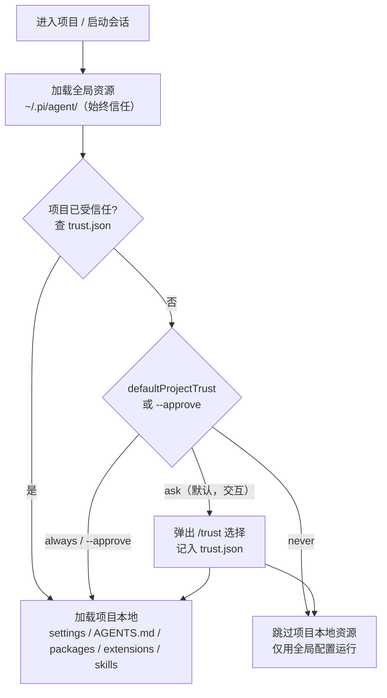

# 第 13 章：三级配置覆盖

> **定位**：本章解析 pi 的配置系统 — 全局、项目、目录三级覆盖如何让同一个工具适应不同场景。
> 前置依赖：第 10 章（Agent 的状态管理）。
> 适用场景：当你想理解 pi 的配置优先级，或者想为自己的开发工具设计分层配置。

## 一个工具如何同时满足所有项目？

这是本章的核心设计问题。

用户 A 在公司项目中使用 Claude Opus，thinking level 设为 high，禁止 agent 修改 `deploy/` 目录。用户 A 在个人项目中使用 GPT-4o，thinking level 设为 medium，没有目录限制。用户 A 的公司项目的 `packages/legacy/` 子目录有特殊规则：只允许修改 `.test.ts` 文件。

一个配置文件搞不定。pi 的解决方案是三级覆盖：

```
~/.pi/agent/          ← 全局配置（所有项目）
  ├── settings.json
  ├── AGENTS.md
  └── SYSTEM.md

/project/.pi/         ← 项目配置（覆盖全局）
  ├── settings.json
  └── AGENTS.md

/project/packages/    ← 目录上溯
  └── legacy/
      └── AGENTS.md   ← 目录级规则（追加）
```

## Settings：完整的可配置维度

`settings.json` 存储结构化配置。Settings 接口定义了 pi 所有可配置的维度：

```typescript
// packages/coding-agent/src/core/settings-manager.ts:63-98（完整接口）

interface Settings {
  // 模型与 provider
  defaultProvider?: string;
  defaultModel?: string;
  defaultThinkingLevel?: "off" | "minimal" | "low" | "medium" | "high" | "xhigh";
  transport?: TransportSetting;       // "sse" | "websocket"
  enabledModels?: string[];           // 模型循环列表

  // 操作模式
  steeringMode?: "all" | "one-at-a-time";
  followUpMode?: "all" | "one-at-a-time";

  // 外观
  theme?: string;
  hideThinkingBlock?: boolean;

  // Compaction 与分支摘要
  compaction?: CompactionSettings;
  branchSummary?: BranchSummarySettings;

  // 重试策略
  retry?: RetrySettings;

  // 终端行为
  terminal?: TerminalSettings;        // showImages, clearOnShrink
  images?: ImageSettings;             // autoResize, blockImages

  // Thinking token 预算
  thinkingBudgets?: ThinkingBudgetsSettings;

  // Shell 定制
  shellPath?: string;
  shellCommandPrefix?: string;
  npmCommand?: string[];

  // 能力扩展
  packages?: PackageSource[];
  extensions?: string[];
  skills?: string[];
  prompts?: string[];
  themes?: string[];
  enableSkillCommands?: boolean;

  // UI 细节
  markdown?: MarkdownSettings;
  editorPaddingX?: number;
  autocompleteMaxVisible?: number;
  showHardwareCursor?: boolean;
  doubleEscapeAction?: "fork" | "tree" | "none";
  treeFilterMode?: "default" | "no-tools" | "user-only" | "labeled-only" | "all";

  // 安全：项目信任（仅全局有效）
  defaultProjectTrust?: "ask" | "always" | "never";  // default: "ask"

  // 杂项
  lastChangelogVersion?: string;
  quietStartup?: boolean;
  collapseChangelog?: boolean;
  sessionDir?: string;
  httpProxy?: string;
  httpIdleTimeoutMs?: number;
}
```

每个子接口也值得展开看看。这些子接口展示了 pi 在不同维度上提供的精细控制：

```typescript
// packages/coding-agent/src/core/settings-manager.ts:7-44

interface CompactionSettings {
  enabled?: boolean;         // default: true
  reserveTokens?: number;    // default: 16384
  keepRecentTokens?: number; // default: 20000
}

interface BranchSummarySettings {
  reserveTokens?: number;    // default: 16384
  skipPrompt?: boolean;      // default: false
}

interface RetrySettings {
  enabled?: boolean;     // default: true
  maxRetries?: number;   // default: 3
  baseDelayMs?: number;  // default: 2000（pi 应用层指数退避：2s, 4s, 8s）
  provider?: ProviderRetrySettings;  // v0.70.1 新增，透传给 SDK/provider
}

interface ProviderRetrySettings {  // settings-manager.ts:21-25
  timeoutMs?: number;       // SDK/provider 单次请求超时
  maxRetries?: number;      // provider 层重试次数
  maxRetryDelayMs?: number; // default: 60000，服务端要求的最大退避，超过即失败
}

interface TerminalSettings {
  showImages?: boolean;      // default: true
  clearOnShrink?: boolean;   // default: false
}

interface ImageSettings {
  autoResize?: boolean;      // default: true（最大 2000x2000）
  blockImages?: boolean;     // default: false
}

interface ThinkingBudgetsSettings {
  minimal?: number;
  low?: number;
  medium?: number;
  high?: number;
}

interface MarkdownSettings {
  codeBlockIndent?: string;  // default: "  "
}
```

注意所有字段都是 optional（`?`）。这是"渐进式定制"的基础 — 用户只需要设置自己关心的字段，其他全部使用默认值。

### 配置维度的设计逻辑

这些配置项可以分为几个层次来理解：

**模型层**：`defaultProvider`、`defaultModel`、`defaultThinkingLevel`、`transport`、`enabledModels` — 控制 agent 使用哪个模型、怎么连接。这是最基础的配置，通常在全局级别设置一次。

**行为层**：`compaction`、`retry`、`branchSummary`、`steeringMode`、`followUpMode` — 控制 agent 的运行策略。比如一个大型 monorepo 项目可能需要更大的 `keepRecentTokens`（因为上下文更复杂），而一个简单的脚本项目可以用默认值。

**环境层**：`terminal`、`images`、`shellPath`、`shellCommandPrefix`、`npmCommand` — 适配不同的运行环境。Cygwin 用户需要自定义 `shellPath`，SSH 环境可能需要 `blockImages`。

**能力层**：`packages`、`extensions`、`skills`、`prompts`、`themes`、`enableSkillCommands` — 控制 pi 加载哪些外部能力。这些配置可以在全局和项目级别分别设置，实现"全局装常用 skills，项目装专用 skills"的效果。

**UI 层**：`markdown`、`editorPaddingX`、`autocompleteMaxVisible`、`showHardwareCursor`、`doubleEscapeAction`、`treeFilterMode` — 纯粹的用户体验偏好，通常只在全局设置。

每一层的默认值都经过精心选择。比如 `retry.baseDelayMs = 2000` 配合指数退避产生 2s → 4s → 8s 的重试间隔 — 既不会因为太频繁而被 API 限流，也不会因为等太久而影响用户体验。`compaction.keepRecentTokens = 20000` 大约相当于 10-15 轮对话，足以保留足够的近期上下文。

> **重试配置分两层（v0.70.1）**：注意 `retry` 现在拆成了两层语义。顶层的 `enabled` / `maxRetries` / `baseDelayMs` 是 **pi 应用层**的退避策略（pi 自己在两次 stream 调用之间等多久再重试）；而 `retry.provider`（`ProviderRetrySettings`）是**透传给底层 SDK/provider** 的参数 —— `timeoutMs`（单次请求超时）、`maxRetries`（provider 自己的重试次数）、`maxRetryDelayMs`（服务端通过 `Retry-After` 要求的最大退避，超过即放弃）。早期版本只有一个扁平的 `retry.maxDelayMs`，它在迁移时被自动搬到 `retry.provider.maxRetryDelayMs`（见 `migrateSettings`，settings-manager.ts:409-430）。把"应用层何时重试"和"provider 层如何重试"分开，是因为这两者解决的是不同层面的失败。

## Settings 的加载与合并

### 两级加载

`SettingsManager` 的核心加载逻辑是：分别加载 global 和 project 两级配置，然后深度合并。

```typescript
// packages/coding-agent/src/core/settings-manager.ts:258-283（简化）

static create(cwd, agentDir): SettingsManager {
  const storage = new FileSettingsStorage(cwd, agentDir);
  return SettingsManager.fromStorage(storage);
}

static fromStorage(storage): SettingsManager {
  const globalLoad = SettingsManager.tryLoadFromStorage(storage, "global");
  const projectLoad = SettingsManager.tryLoadFromStorage(storage, "project");
  // 收集加载错误但不中断
  return new SettingsManager(
    storage,
    globalLoad.settings,
    projectLoad.settings,
    globalLoad.error,
    projectLoad.error,
  );
}
```

文件路径固定：
- 全局：`~/.pi/agent/settings.json`
- 项目：`{cwd}/.pi/settings.json`

加载使用 `tryLoadFromStorage` — 如果文件不存在或 JSON 解析失败，返回空对象 `{}` 而不是崩溃。错误被记录下来，可以后续通过 `drainErrors()` 检查。这个设计让 pi 在配置文件损坏时仍然能启动。

### 深度合并策略

两级配置通过 `deepMergeSettings` 合并：

```typescript
// packages/coding-agent/src/core/settings-manager.ts:101-129（简化）

function deepMergeSettings(base: Settings, overrides: Settings): Settings {
  const result = { ...base };
  for (const key of Object.keys(overrides)) {
    const overrideValue = overrides[key];
    const baseValue = base[key];

    if (overrideValue === undefined) continue;

    // 嵌套对象：递归合并
    if (typeof overrideValue === "object" && !Array.isArray(overrideValue)
        && typeof baseValue === "object" && !Array.isArray(baseValue)) {
      result[key] = { ...baseValue, ...overrideValue };
    } else {
      // 原始值和数组：项目覆盖全局
      result[key] = overrideValue;
    }
  }
  return result;
}
```

合并规则：
- **原始值**（string, number, boolean）：项目值覆盖全局值
- **数组**（packages, extensions, skills 等）：项目值**完全替换**全局值（不是追加）
- **嵌套对象**（compaction, retry, terminal 等）：递归合并，项目中指定的子字段覆盖对应全局子字段

最后一条很重要。如果全局设置了 `compaction: { enabled: true, reserveTokens: 16384 }`，项目只设置 `compaction: { keepRecentTokens: 30000 }`，合并结果是 `{ enabled: true, reserveTokens: 16384, keepRecentTokens: 30000 }`。项目不需要重复声明 `enabled` 和 `reserveTokens`。

```
优先级：项目 settings.json > 全局 settings.json > 内建默认值
```

### Settings 迁移

pi 的配置格式会随版本演进而变化。`migrateSettings` 函数处理旧格式的自动迁移：

```typescript
// packages/coding-agent/src/core/settings-manager.ts:317-352（简化）

static migrateSettings(settings): Settings {
  // queueMode → steeringMode
  if ("queueMode" in settings && !("steeringMode" in settings)) {
    settings.steeringMode = settings.queueMode;
    delete settings.queueMode;
  }

  // websockets: boolean → transport: "sse" | "websocket"
  if (typeof settings.websockets === "boolean") {
    settings.transport = settings.websockets ? "websocket" : "sse";
    delete settings.websockets;
  }

  // skills: { enableSkillCommands, customDirectories } → skills: string[]
  // （旧的对象格式迁移为新的数组格式）
  // ...
}
```

迁移在**每次加载时**自动执行，但不会立即回写文件。只有当用户下次修改设置时，新格式才会被持久化。这避免了无谓的文件写入。

### 持久化与锁

设置的保存使用了文件锁来防止并发写入：

```typescript
// packages/coding-agent/src/core/settings-manager.ts:178-206（简化）

withLock(scope, fn): void {
  const path = scope === "global" ? this.globalSettingsPath : this.projectSettingsPath;
  let release;
  try {
    if (existsSync(path)) {
      release = this.acquireLockSyncWithRetry(path);
    }
    const current = existsSync(path) ? readFileSync(path, "utf-8") : undefined;
    const next = fn(current);
    if (next !== undefined) {
      if (!existsSync(dir)) mkdirSync(dir, { recursive: true });
      if (!release) release = this.acquireLockSyncWithRetry(path);
      writeFileSync(path, next, "utf-8");
    }
  } finally {
    if (release) release();
  }
}
```

保存时不是简单地覆盖文件，而是读取当前文件内容，只合并本次会话中修改过的字段（通过 `modifiedFields` 追踪），再写回。这意味着如果用户在另一个 pi 实例中修改了 settings，本实例不会覆盖那些更改。

## AGENTS.md 的拼接规则

`AGENTS.md`（或 `CLAUDE.md`）的规则不同于 settings — 它是**拼接**而非覆盖。

### 目录树上溯发现

`loadProjectContextFiles` 函数从当前工作目录向上搜索，收集路径上所有的 context 文件：

```typescript
// packages/coding-agent/src/core/resource-loader.ts:58-113（简化）

function loadProjectContextFiles(options): Array<{ path; content }> {
  const contextFiles = [];
  const seenPaths = new Set();

  // 1. 先加载全局 context（~/.pi/agent/AGENTS.md 或 CLAUDE.md）
  const globalContext = loadContextFileFromDir(resolvedAgentDir);
  if (globalContext) {
    contextFiles.push(globalContext);
    seenPaths.add(globalContext.path);
  }

  // 2. 从 cwd 向上遍历到根目录
  const ancestorContextFiles = [];
  let currentDir = resolvedCwd;
  while (true) {
    const contextFile = loadContextFileFromDir(currentDir);
    if (contextFile && !seenPaths.has(contextFile.path)) {
      ancestorContextFiles.unshift(contextFile); // 最远的在前
      seenPaths.add(contextFile.path);
    }
    if (currentDir === root) break;
    currentDir = resolve(currentDir, "..");
  }

  // 3. 全局在前，祖先目录从远到近排列
  contextFiles.push(...ancestorContextFiles);
  return contextFiles;
}
```

`loadContextFileFromDir` 在每个目录中依次查找 `AGENTS.md` 和 `CLAUDE.md`，找到第一个就返回。这意味着如果同一个目录同时有 `AGENTS.md` 和 `CLAUDE.md`，只有 `AGENTS.md` 会被加载（它在候选列表中排第一）。

```typescript
// packages/coding-agent/src/core/resource-loader.ts:58-74

function loadContextFileFromDir(dir: string) {
  const candidates = ["AGENTS.md", "CLAUDE.md"];
  for (const filename of candidates) {
    const filePath = join(dir, filename);
    if (existsSync(filePath)) {
      return { path: filePath, content: readFileSync(filePath, "utf-8") };
    }
  }
  return null;
}
```

最终的拼接顺序：

```
1. ~/.pi/agent/AGENTS.md         ← 全局规则（最先注入）
2. /AGENTS.md                    ← 根目录（如果有）
3. /project/AGENTS.md            ← 项目根目录
4. /project/packages/AGENTS.md   ← 子目录
5. /project/packages/legacy/AGENTS.md  ← 当前工作目录
```

三者**同时生效**，后者可以补充或细化前者的规则。这些文件最终被注入到 system prompt 的 `<project_context>` 区域（v0.75.0 起用 XML 标签包裹，见第 14 章）。

### SYSTEM.md 的替换规则

`SYSTEM.md` 的规则又不同 — 它是**替换**而非拼接：

```
如果项目 .pi/SYSTEM.md 存在 → 替换默认 system prompt
否则如果全局 SYSTEM.md 存在 → 替换默认 system prompt
否则 → 使用默认 system prompt
```

```typescript
// packages/coding-agent/src/core/resource-loader.ts:834-846

private discoverSystemPromptFile(): string | undefined {
  const projectPath = join(this.cwd, CONFIG_DIR_NAME, "SYSTEM.md");
  if (existsSync(projectPath)) return projectPath;
  const globalPath = join(this.agentDir, "SYSTEM.md");
  if (existsSync(globalPath)) return globalPath;
  return undefined;
}
```

pi 还支持 `APPEND_SYSTEM.md` — 一个追加到 system prompt 末尾的文件，发现逻辑与 SYSTEM.md 相同（项目优先于全局）。这让用户可以在不替换默认 prompt 的情况下追加内容。

为什么 AGENTS.md 拼接而 SYSTEM.md 替换？

因为它们的语义不同。AGENTS.md 是"额外的规则" — 目录级规则不应该消灭全局规则，而是在全局规则的基础上添加新的约束。SYSTEM.md 是"完全自定义的 system prompt" — 如果用户要自定义 system prompt，通常是想完全控制 prompt 的内容，而不是在默认 prompt 后面追加一段。

## PackageSource：外部能力的配置

Settings 中的 `packages` 字段支持两种格式 — 简单字符串和带过滤的对象：

```typescript
// packages/coding-agent/src/core/settings-manager.ts:48-62

type PackageSource =
  | string                          // 加载包的全部资源
  | {
      source: string;               // npm 包名或 git URL
      extensions?: string[];        // 只加载指定 extensions
      skills?: string[];            // 只加载指定 skills
      prompts?: string[];           // 只加载指定 prompts
      themes?: string[];            // 只加载指定 themes
    };
```

这种设计让用户可以安装一个大型的能力包（比如包含 20 个 skills 的社区包），但只启用其中几个。配置示例：

```json
{
  "packages": [
    "pi-community-skills",
    { "source": "pi-advanced-tools", "skills": ["tdd", "code-review"] }
  ]
}
```

## 配置的运行时行为

### Getter 中的默认值

SettingsManager 为每个配置项提供 getter 方法，默认值在 getter 中硬编码而非在 Settings 对象中：

```typescript
// packages/coding-agent/src/core/settings-manager.ts:617-644（示例）

getCompactionEnabled(): boolean {
  return this.settings.compaction?.enabled ?? true;
}

getRetrySettings() {
  return {
    enabled: this.getRetryEnabled(),
    maxRetries: this.settings.retry?.maxRetries ?? 3,
    baseDelayMs: this.settings.retry?.baseDelayMs ?? 2000,
  };
}
```

为什么不在构造时填入默认值？因为这样保持了 `globalSettings` 和 `projectSettings` 的"原始状态" — 它们只包含用户显式设置的字段。这对于 `persistScopedSettings` 很重要：保存时只写入用户修改过的字段，不会把默认值写入文件。如果默认值将来改变，用户的配置文件不需要手动更新。

### 运行时覆盖

除了全局和项目两级，`SettingsManager` 还支持运行时覆盖：

```typescript
// packages/coding-agent/src/core/settings-manager.ts:390-393

applyOverrides(overrides: Partial<Settings>): void {
  this.settings = deepMergeSettings(this.settings, overrides);
}
```

这用于 CLI 参数等临时性的配置。比如 `pi --model gpt-4o` 会在运行时覆盖 `defaultModel`，但不会写入任何配置文件。这构成了实际上的第四级配置：CLI 参数 > 项目 settings > 全局 settings > 默认值。

### Reload 机制

当用户在会话中修改了配置文件（比如在另一个终端编辑 `settings.json`），pi 可以通过 `reload()` 方法重新加载：

```typescript
// packages/coding-agent/src/core/settings-manager.ts:362-388（简化）

async reload(): Promise<void> {
  await this.writeQueue;  // 等待未完成的写入
  const globalLoad = SettingsManager.tryLoadFromStorage(this.storage, "global");
  const projectLoad = SettingsManager.tryLoadFromStorage(this.storage, "project");
  // 清除修改追踪
  this.modifiedFields.clear();
  this.modifiedNestedFields.clear();
  // 重新合并
  this.settings = deepMergeSettings(this.globalSettings, this.projectSettings);
}
```

`reload` 先等待写入队列完成（防止读到半写的状态），然后重新从存储加载两级配置。这是一个"热重载"机制 — 用户不需要重启 pi 就能看到配置变更的效果。

## 第四道闸门：Project Trust

到这里为止，本章一直把"项目级配置覆盖全局"当作无条件的事实 —— 进入一个目录，它的 `.pi/settings.json`、`AGENTS.md`、甚至 `packages`/`extensions`/`skills` 就自动加载并生效。但从 **v0.79.0** 起，这个假设不再成立。

问题出在威胁模型上。前三级覆盖里，项目级配置是**可执行的攻击面**：一个 `.pi/settings.json` 可以通过 `packages` 字段让 pi 从 npm/git 拉取并加载任意代码，`extensions` 可以注入运行时钩子，`AGENTS.md` 能往 system prompt 里塞入任意指令。这意味着——**仅仅 `cd` 进一个 clone 下来的陌生仓库并启动 pi，就可能执行该仓库作者预置的代码**。三级覆盖越方便，这个口子就越危险。

pi 的解法是在"项目本地资源加载"之前插入一道**信任闸门**：



闸门的关键约定：

**1. 全局资源始终信任，项目资源需要决策**。`~/.pi/agent/` 下的配置是用户自己的，无条件加载。只有**项目本地**那一层（`{cwd}/.pi/`）受闸门管辖。这与三级覆盖的优先级是正交的两个维度：优先级回答"谁覆盖谁"，信任回答"项目这一级到底加不加载"。

**2. 决策结果持久化在全局**。一旦用户对某个项目作出信任决定，它被写入 `~/.pi/agent/trust.json`（`trust-manager.ts:212`，路径基于 `agentDir`，因此也遵循下文的 `CONFIG_DIR_NAME`）。下次进入同一项目不再询问。注意它存在**全局**而非项目内 —— 否则攻击者只要在自己仓库里预置一个"已信任"标记就能绕过闸门。

**3. 三种默认策略 + 一个一次性开关**。全局设置 `defaultProjectTrust` 取 `"ask" | "always" | "never"`（默认 `"ask"`，且**仅全局有效**，`settings-manager.ts:61,95`）：`ask` 在交互模式下弹出 `/trust` 选择器询问；`always` 自动信任所有项目；`never` 一律跳过项目本地资源。命令行上 `--approve` / `-a` 是一次性开关 —— "本次运行信任项目本地文件"（`args.ts:180`），用于自动化/CI 等非交互场景显式授权。会话内还能用 `/trust` 命令随时改变当前项目的信任状态。

**4. extension 可介入信任决策**。闸门会触发 `project_trust` 扩展事件（`types.ts:504`），extension 也能通过 `ctx.isProjectTrusted()`（`types.ts:318`）查询当前项目是否受信任 —— 例如一个企业策略 extension 可以据此决定是否放行。

判定"这个项目是否含有需要信任才能加载的本地资源"由 `hasTrustRequiringProjectResources(cwd)` 完成（`interactive-mode.ts:3281`）：如果项目根本没有 `.pi/` 本地资源，就没有可执行攻击面，闸门直接放行、不打扰用户。

这道闸门改变了第 17 章 Resource Loader 的加载流程 —— 项目本地资源的 `reload` 现在夹在"全局先加载、项目后加载"之间多了一步信任检查（详见第 17 章）。它也是 pi 在"开箱即用的便利"与"陌生仓库的安全"之间做出的明确取舍：默认 `ask` 让便利与安全都不极端。

> **`CONFIG_DIR_NAME` 作为 rebrand 扩展点（v0.70.0）**：本章多处出现的 `.pi` 目录名其实并非硬编码常量，而是从 `config.ts` 导出的 `CONFIG_DIR_NAME`（v0.79.7 起公开导出）。`SYSTEM.md` 发现（`resource-loader.ts`）、`trust.json` 路径、CLI 帮助文本里的示例路径都引用它。这让基于 pi 二次封装、换皮（rebrand）成自有产品的下游能统一改掉配置目录名，而不必到处替换字符串。

## 取舍分析

### 得到了什么

**1. 零配置启动**。不创建任何配置文件，pi 用内建默认值就能工作。所有 Settings 字段都是 optional，默认值在 getter 中硬编码。

**2. 渐进式定制**。用户可以从全局 settings 开始，遇到特殊项目时加项目配置，遇到特殊目录时加目录规则。复杂度只在需要时引入。

**3. 团队共享**。项目级的 `.pi/` 目录和 `AGENTS.md` 可以提交到 git，团队成员自动继承项目规则。全局配置保持个人偏好。

**4. 并发安全**。文件锁 + 只写入修改过的字段，多个 pi 实例可以安全地共享同一个 settings 文件。

### 放弃了什么

**1. 心智负担**。三级覆盖意味着用户需要理解"我的这个配置到底从哪来"。当行为不符合预期时，需要检查三个地方（甚至更多，如果目录树上有多个 AGENTS.md）。

**2. 不同规则类型的合并语义不同**。settings 是深度合并（嵌套对象递归、数组替换）、AGENTS.md 是拼接、SYSTEM.md 是替换 — 三种不同的合并语义增加了理解成本。

**3. 没有"dry run"或"explain"命令**。用户不能简单地查看"当前生效的完整配置是什么"。需要自己推理合并后的结果。

**4. 信任闸门引入了额外的摩擦**。Project Trust（v0.79.0）虽然堵上了"进入陌生仓库即执行预置代码"的口子，但代价是首次进入一个带本地资源的项目时多了一次询问。`defaultProjectTrust` 的三种取值本质上是在"安全"与"零打扰"之间让用户自己选位置。

---

### 版本演化说明
> 本章核心分析基于 pi-mono v0.66.0，已校订至 v0.79.7。三级覆盖的核心结构自引入以来稳定，但有两处设计级增补：
> ① **Project Trust 信任闸门**（v0.79.0）：项目本地 settings/resources/extensions/packages/skills 的加载现在受 `defaultProjectTrust`（ask/always/never）、`--approve`、`/trust` 与 `~/.pi/agent/trust.json` 管辖，不再无条件加载。
> ② **重试配置分层**（v0.70.1）：`retry` 拆为应用层退避与 `retry.provider.*`（透传 SDK），旧 `retry.maxDelayMs` 自动迁移到 `retry.provider.maxRetryDelayMs`。
> 此外 Settings 可配置项持续扩展（httpProxy、httpIdleTimeoutMs、自动 light/dark 主题等），`.pi` 目录名由 `CONFIG_DIR_NAME` 提供以支持 rebrand。
> `AGENTS.md`/`CLAUDE.md` 双支持、PackageSource 对象格式、`migrateSettings` 自动迁移均保持不变。
