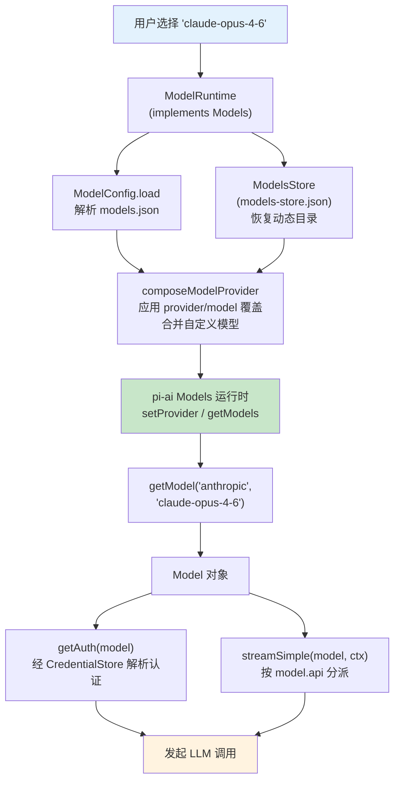

# 第 18 章：Model Registry — 模型不只是一个 ID

> **定位**：本章解析模型选择背后的配置系统和动态注册机制。
> 前置依赖：第 4 章（Provider Registry）、第 13 章（配置覆盖）。
> 适用场景：当你想理解 pi 如何管理模型列表，或者想添加自定义模型。

## 选模型 = 选 provider + 选 api + 选参数

用户在 pi 中选择一个"模型"，背后实际上是选择了一组参数：

```typescript
// file: packages/ai/src/types.ts:749
interface Model<TApi extends Api> {
  id: string;            // "claude-opus-4-6"
  name: string;          // "Claude Opus 4.6"
  api: TApi;             // "anthropic-messages"
  provider: ProviderId;  // "anthropic"（v0.80.0 起由旧名 Provider 改来）
  baseUrl?: string;      // API endpoint
  cost: { input; output; cacheRead; cacheWrite };
  contextWindow: number; // 200000
  maxTokens: number;     // 32768
  input: ("text" | "image" | "audio")[];
  reasoning: boolean;    // true
  thinkingLevelMap?: ThinkingLevelMap; // 见下文
}
```

其中 `thinkingLevelMap`（`types.ts:760`）是后来新增的顶层字段：它把 pi 统一的思考档位（`off`/`minimal`/`low`/`medium`/`high`/`xhigh`/`max`）映射到该 provider 专用的取值，`null` 表示某档位不支持。配套的 `getSupportedThinkingLevels(model)` 与 `clampThinkingLevel(model, level)`（`models.ts:663`、`:674`）据此计算模型实际支持的档位并把越界请求收敛到最近的合法档。它取代了早期写在 `compat.reasoningEffortMap` 里的映射（旧的 `supportsXhigh()` 也随之废弃）。

这些参数来自三个来源：

1. **内建模型目录**：pi 内置了一个生成的 TypeScript 文件，列出所有已知模型的参数
2. **`models.json` 自定义**：用户可以在全局配置中添加、覆盖模型定义
3. **Extension 动态注册**：Extension 可以注册新的 API provider（第 4 章的 `registerApiProvider`），随之带来新的模型

## 内建模型目录的生成

pi 不手动维护模型列表 — 它通过自动化脚本从各 provider 的 API 抓取最新数据并生成代码。

```typescript
// file: packages/ai/scripts/generate-models.ts:1-10
#!/usr/bin/env tsx
import { writeFileSync } from "fs";
import { join, dirname } from "path";
import { fileURLToPath } from "url";
import { Api, KnownProvider, Model } from "../src/types.js";

const __filename = fileURLToPath(import.meta.url);
const __dirname = dirname(__filename);
const packageRoot = join(__dirname, "..");
```

这个脚本从 OpenRouter / AI Gateway 等来源抓取模型列表与元数据（context window、定价、是否支持 tool calling），合并 Anthropic、Google、Bedrock 等主流 provider，生成内建目录。

> **拆包重构（v0.80.0）**：早期它生成的是**单体** `models.generated.ts`（一个巨大的 `export const MODELS = {...}` 对象）。现在目录**按 provider 拆分**成 per-provider 的 `providers/*.models.ts`，每个只导入自己的一份 JSON 数据并展开：

```typescript
// file: packages/ai/src/providers/anthropic.models.ts:1-8
// This file is auto-generated by scripts/generate-models.ts
import values from "./data/anthropic.json" with { type: "json" };
import { flattenModelCatalog, type ModelCatalog } from "../model-catalog.ts";

export const ANTHROPIC_MODELS: ModelCatalog<typeof values, "anthropic"> =
  flattenModelCatalog("anthropic", values);
```

`models.generated.ts` 退化为一个**纯聚合器**：把 37 份 `*_MODELS` 拼成 `MODELS` 对象（`models.generated.ts:42`），类型上保留 `readonly "anthropic": typeof ANTHROPIC_MODELS` 这样的精确映射。拆分的收益是 tree-shaking：一个只用 Anthropic 的下游可以只带走 `anthropic.models.ts` 那一份数据，而不必把全部 provider 的模型 JSON 打进 bundle（呼应第 4 章的 core-only 拆包）。

**读内建目录的现行 API 在 `providers/all.ts`**，不再直接读 `MODELS`：

```typescript
// file: packages/ai/src/providers/all.ts:59-84（节选）

/** 类型化地读单个内建模型。 */
export function getBuiltinModel<TProvider, TModelId>(
  provider: TProvider, modelId: TModelId): Model</* 推断出的 api */> { ... }

/** 读某个 provider 的全部内建模型。 */
export function getBuiltinModels<TProvider>(provider: TProvider): Model<...>[] { ... }

/** 内建目录的生成时间戳（取代旧的 getBuiltinModelDataUrl）。 */
export function getBuiltinModelDataGeneratedAt(): number | undefined {
  const generatedAt = Date.parse(modelDataManifest.generatedAt);
  return Number.isNaN(generatedAt) ? undefined : generatedAt;
}
```

`getBuiltinModel` / `getBuiltinModels`（`all.ts:59`/`:77`）是类型化的静态目录读法：泛型参数从 `MODELS` 的形状里把 `api` 推断出来，让返回的 `Model<TApi>` 精确到协议。`getBuiltinModelDataGeneratedAt`（`all.ts:72`）是 **v0.82.0 的 Breaking 变更** — 它取代了旧的 `getBuiltinModelDataUrl(provider)`：上层现在关心的不是"目录数据从哪个 URL 来"，而是"这份内建数据是什么时候生成的"（用于判断新鲜度、决定要不要触发动态刷新）。时间戳来自随目录一起生成的 `providers/data/.manifest.json`。

**每次构建 pi-ai 都会重新生成模型目录**（`package.json` 的 `build` 脚本先跑 `generate-models`）。这意味着每次发布新版本时，模型目录自动包含最新的模型。

这个设计有一个重要的取舍：**模型数据在构建时确定，而不是运行时查询**。

得到了什么：离线可用 — pi 不需要网络连接就能显示模型列表。启动速度 — 不需要等待 API 响应。确定性 — 同一个版本的 pi 永远看到同样的内建模型列表。

放弃了什么：时效性 — 新模型发布后，用户需要等 pi 的下一个版本才能在内建目录中看到它。（但用户可以通过 `models.json` 立即使用新模型，或经动态刷新拉取 — 见下节与本章后文。）

## 动态目录的持久化：`ModelsStore` 与 etag 条件刷新

内建目录是构建时冻结的静态数据，但有些 provider 的模型列表是**动态**的 — 它随订阅、随远程目录变化。第 4 章讲过 `Provider.refreshModels` 和 `Models.refresh`：动态 provider 用凭证去远程拉取最新列表。这份动态列表需要一个持久化的落点，就是 `ModelsStore`：

```typescript
// file: packages/ai/src/models-store.ts:3-21

export interface ModelsStoreEntry {
  models: readonly Model<Api>[];
  lastModified?: number;   // 远程 Last-Modified
  checkedAt?: number;      // 上次完成远程检查的时间
  etag?: string;           // 远程 ETag，原样存、原样回传为 If-None-Match
}

export interface ModelsStore {
  read(providerId: string): Promise<ModelsStoreEntry | undefined>;
  write(providerId: string, entry: ModelsStoreEntry): Promise<void>;
  delete(providerId: string): Promise<void>;
}
```

`ModelsStore` 按 provider id 存一份 `ModelsStoreEntry`。`Models` 默认用 `InMemoryModelsStore`（`models-store.ts:28`，进程内、测试用），产品层可注入一个落盘实现。刷新时 `Models` 把它包装成 provider-scoped 的 `ProviderModelsStore`（`read/write/delete` 都不带 providerId），provider 只能碰自己的那一格，碰不到别家的目录。

`etag` 字段（v0.82.1）是**条件刷新**的关键。provider 拉取时把上次存下的 `etag` 作为 `If-None-Match` 头发出去，远程若返回 `304 Not Modified`，就说明目录没变，直接复用缓存、不重新解析。这把"每次刷新都全量下载 + 解析模型列表"降级为"大多数刷新只花一个条件请求的往返"。配合 `Models.refresh({ force })`（`models.ts:276`，可绕过 provider 的新鲜度检查强制拉取）和 per-provider 的错误/取消隔离（一个 provider 刷新失败不影响其余），动态目录的刷新既省流量又稳健。

`createProvider` 内部已经把这套缓存-拉取-落盘的时序封装好了（`models.ts:596-617`）：先从 store 恢复上次的动态列表，若允许网络再 `fetchModels`，成功后写回 store。provider 作者只需提供一个 `fetchModels` 函数，不必自己管缓存与并发。

## models.json 覆盖机制

用户可以在 `~/.pi/agent/models.json` 中自定义模型。这个文件遵循严格的 JSON Schema。**注意 schema 及其解析已经从 `model-registry.ts` 迁到独立的 `ModelConfig`（`model-config.ts`）** —— 这是本区间 coding-agent 侧模型管理重构的一部分（详见下文 ModelRuntime）：

```typescript
// file: packages/coding-agent/src/core/model-config.ts:154-167
const ModelDefinitionSchema = Type.Object({
  id: Type.String({ minLength: 1 }),
  name: Type.Optional(Type.String({ minLength: 1 })),
  api: Type.Optional(Type.String({ minLength: 1 })),
  baseUrl: Type.Optional(Type.String({ minLength: 1 })),
  reasoning: Type.Optional(Type.Boolean()),
  thinkingLevelMap: Type.Optional(ThinkingLevelMapSchema),
  input: Type.Optional(Type.Array(
    Type.Union([Type.Literal("text"), Type.Literal("image")])
  )),
  cost: Type.Optional(ModelCostSchema),
  contextWindow: Type.Optional(Type.Number()),
  maxTokens: Type.Optional(Type.Number()),
  headers: Type.Optional(Type.Record(Type.String(), Type.String())),
  compat: Type.Optional(ProviderCompatSchema),
});
```

注意 schema 的设计：除了 `id`，所有字段都是 **optional**。这意味着用户定义一个本地模型时，只需提供最少的信息：

```json
{
  "providers": {
    "my-local-llm": {
      "baseUrl": "http://localhost:11434/v1",
      "api": "openai-completions",
      "models": [
        { "id": "llama-3.3-70b" }
      ]
    }
  }
}
```

未指定的字段会使用合理的默认值。这降低了添加本地模型（Ollama、LM Studio 等）的门槛。

### 覆盖内建模型

`models.json` 不仅能添加新模型，还能覆盖内建模型的参数。通过 `modelOverrides` 字段（`ModelOverrideSchema`，`model-config.ts:169`）：schema 与 `ModelDefinitionSchema` 几乎同构，但 `cost` 字段内部每一项也都是 optional —— 你可以只覆盖 `input` 定价而保留其他定价不变。

覆盖的**应用**逻辑（把 override deep-merge 进内建模型）已经从旧的 `ModelRegistry.applyModelOverride` 迁到 `provider-composer.ts` 的 `applyModelOverride`（`provider-composer.ts:100-120`）：它逐字段覆盖简单值，对 `cost` 做 partial merge（`override.cost.input ?? model.cost.input`），对 `compat` 用 `mergeCompat`。`composeModelProvider` 在装配 provider 时对每个模型应用一次 override（`provider-composer.ts:423-436`）—— 也就是说，覆盖不再由 coding-agent 手写的 `loadModels` 循环完成，而是作为"最上层用户配置"注入 pi-ai 的 `Models` 运行时（见下文 ModelRuntime）。

## ModelRuntime：规范的异步 model/auth 门面

到这里，一个重要的架构变化必须交代。coding-agent 侧原来以 `ModelRegistry` 为中心 —— 它同步持有一份 `Model[]`，构造时 `new ModelRegistry(authStorage, modelsJsonPath)` 就地 `loadModels()`。**从 v0.80.8 起（Breaking），这个中心让位给了 `ModelRuntime`（`model-runtime.ts`）**：它是一个 `implements Models` 的**异步**门面，统一管模型配置、认证、provider 自有 `/login`、以及动态 provider 目录。`ModelRegistry` 降级为一层面向 extension 的**同步 compat 投影**。

```typescript
// file: packages/coding-agent/src/core/model-runtime.ts:94,133
export class ModelRuntime implements Models {
  static async create(
    options: CreateModelRuntimeOptions = {},
  ): Promise<ModelRuntime> {
    const credentials = new RuntimeCredentials(
      options.credentials ?? DefaultAuthStorage.create(options.authPath));
    const config = await ModelConfig.load(modelsPath);      // 解析 models.json
    const modelsStore = modelsPath
      ? new FileModelsStore(/* …/models-store.json */)      // 动态目录落盘
      : new InMemoryCodingAgentModelsStore();
    const providers = builtinProviders().map((p) =>          // 内建 provider
      withRemoteCatalog(p, options.catalogBaseUrl, generatedAt)); // 套远程目录
    const runtime = new ModelRuntime(credentials, config, modelsPath,
      modelsStore, providers, /* networkEnabled */);
    runtime.rebuildProviders();
    await runtime.refresh({ allowNetwork: /* … */ });
    return runtime;
  }
}
```

注意几个关键点：构造是 `static async create()`（因为要读盘、可能拉网络），不再是旧的同步 `new`；它不再接收 `AuthStorage` 而是接收一个 `CredentialStore`（认证子系统的口径见第 4-7 章）；models.json 的解析交给独立的 `ModelConfig`（`model-config.ts`），动态目录交给 `ModelsStore`（下节）。

`rebuildProviders()` 是覆盖真正生效的地方：它对每个 provider 调用 `composeModelProvider(providerId, base, config, extension)`，把 models.json 的 provider 覆盖、`modelOverrides`、自定义模型作为"最上层用户配置"注入 pi-ai 的 `Models`（`this.models.setProvider(...)`，`model-runtime.ts:215`）。也就是说，前一节讲的 override 应用、以及"自定义模型按 `provider + id` 合并、冲突时自定义优先"这些规则，如今都由 pi-ai 的 `Models` 运行时统一执行，coding-agent 不再手写 `loadModels` 循环。

### ModelRegistry 作为 compat 投影

那么 `ModelRegistry` 还在吗？在 —— 但它现在只是 `ModelRuntime` 的一层薄壳，其唯一存在理由是给 extension 一个**同步**读法（extension API 面历史上是同步的）：

```typescript
// file: packages/coding-agent/src/core/model-registry.ts:16-38
/**
 * Synchronous compatibility facade exposed to extensions.
 * Coding-agent internals use ModelRuntime directly.
 */
export class ModelRegistry {
  constructor(runtime: ModelRuntime) { this.runtime = runtime; }

  /** Reload models.json asynchronously. Await before synchronous reads. */
  async refresh(): Promise<void> { await this.runtime.refresh(); }

  getAll(): Model<Api>[] { return [...this.runtime.getModels()]; }
  getAvailable(): Model<Api>[] {
    return [...this.runtime.getAvailableSnapshot()];
  }
  find(provider: string, modelId: string): Model<Api> | undefined {
    return this.runtime.getModel(provider, modelId);
  }
}
```

两处口径变化值得钉住：① 构造从 `new ModelRegistry(authStorage, modelsJsonPath)` 变成 `new ModelRegistry(runtime)` —— 它不再自己读盘，而是投影一个已经装配好的 `ModelRuntime`；② `refresh()` 的返回类型从 `void` 改成 **`Promise<void>`**（Breaking），因为底层的目录刷新本质上是异步的（要读盘、可能走网络）。extension 若在同步读之前要保证拿到最新目录，必须先 `await registry.refresh()`。

### 模型解析的完整流程（经 ModelRuntime）

当用户选择 "claude-opus-4-6" 时，现行的解析路径是：



`ModelRuntime` 对外暴露的就是 `Models` 接口那套异步方法：`getModels()` / `getModel(provider, id)` / `getAvailableSnapshot()`（`model-runtime.ts:301`/`:305`/`:330`）读目录，`getAuth(model)`（`:376`）解析认证，`streamSimple(model, ctx)`（`:492`）按 `model.api` 分派到具体 provider。SDK 的 `createAgentSession` 直接吃一个 `modelRuntime`（第 26b 章），不再传 `authStorage` + `modelRegistry` 两件套。

## 动态目录落盘：`models-store.json` 与条件刷新

前面 pi-ai 侧的 `ModelsStore` 是接口；coding-agent 侧要给它一个**落盘**实现，这就是 `FileModelsStore`（`models-store.ts:28`）。它把每个 provider 的动态目录写进 `~/.pi/agent/models-store.json`，并复用会话/认证同款的文件锁（`withLock`）保证并发安全；测试则用 `InMemoryCodingAgentModelsStore`。

真正省流量的是**条件刷新**。动态 provider（pi.dev 远程目录）由 `withRemoteCatalog` 包裹（`model-runtime.ts:149`），刷新时把上次存下的 `etag` 作为 `If-None-Match` 发出去：

```typescript
// file: packages/coding-agent/src/core/remote-catalog-provider.ts:73-90（节选）
const validator = stored?.models.length ? stored.etag : undefined;
const response = await fetch(url, {
  headers: { accept: "application/json",
    ...(validator ? { "if-none-match": validator } : {}) },
  signal: context.signal,
});
// 304 Not Modified：目录没变，只推进 checkedAt，复用缓存的 overlay
if (response.status === 304 && stored) {
  await context.store.write({ ...stored, checkedAt });
  return;
}
```

远程若回 `304 Not Modified`，就说明目录没变，直接复用 store 里缓存的模型、只推进 `checkedAt`，**不重新下载、不重新解析**。这把"每次刷新都全量拉目录"降级为"多数刷新只花一个条件请求的往返"。刷新还带 per-provider 的错误/取消隔离：一个 provider 拉取失败（非 2xx）时保留旧 etag 让下次重试，不影响其余 provider。

这套刷新已经**移出启动路径**（不再阻塞冷启动）。要主动强刷，用命令 `pi update --models`（`package-manager-cli.ts:728`，调用 `refreshModelCatalogs`），它绕过新鲜度窗口强制重拉所有目录；交互中切 `/model` 也会在后台触发刷新。

## Extension 注册新 Provider 的能力

Model 系统最有趣的扩展点仍在：extension 可以注册全新的 provider（第 15 章的 `registerProvider`），任何使用该 api 的 model 定义随之可用。比如一个私有部署的 OpenAI 兼容端点：extension 注册一个 `"openai-responses"` provider，用户在 `models.json` 里加一条指向自定义 `baseUrl` 的模型定义，pi 就能用它。

承接这种动态注册的是 `ModelRuntime.refresh()`（`model-runtime.ts:516`）—— 它重新跑 `configureRadiusProviders()` + `rebuildProviders()`，用最新的 `ModelConfig` 与 extension 注册重建整份 provider 列表。因为 `rebuildProviders` 每次都从内建 provider + 配置**重新装配**，`refresh` 后的状态天然一致，不会残留旧注册。extension 侧通过 compat 投影 `ModelRegistry.refresh()`（返回 `Promise<void>`）触达同一条路径。

`max` / `xhigh` 两个更高的 thinking 档位也在本区间贯穿了 CLI/SDK/RPC 与主题 —— 模型实际支持哪些档由 `thinkingLevelMap` 决定（见本章开头），越界请求被 `clampThinkingLevel` 收敛到最近合法档。

## OpenAI 兼容性层 (compat)

`Model` 类型中有一个 `compat` 字段，它是 Model Registry 中最复杂的部分：

```typescript
// file: packages/coding-agent/src/core/model-config.ts:72-108（节选）
const OpenAICompletionsCompatSchema = Type.Object({
  supportsStore: Type.Optional(Type.Boolean()),
  supportsDeveloperRole: Type.Optional(Type.Boolean()),
  supportsReasoningEffort: Type.Optional(Type.Boolean()),
  maxTokensField: Type.Optional(Type.Union([
    Type.Literal("max_completion_tokens"),
    Type.Literal("max_tokens")
  ])),
  thinkingFormat: Type.Optional(Type.Union([
    Type.Literal("openai"), Type.Literal("openrouter"),
    Type.Literal("together"), Type.Literal("deepseek"),
    Type.Literal("zai"), Type.Literal("qwen"),
    Type.Literal("qwen-chat-template"),
  ])),
  openRouterRouting: Type.Optional(OpenRouterRoutingSchema),
  // ... 更多字段
});
```

> **版本变化（v0.72.0，破坏性）**：早期 `compat` 里有一个 `reasoningEffortMap` 字段承载"pi 档位 → provider effort 值"的映射。它已被移除，映射上移为 `Model` 的顶层 `thinkingLevelMap`（见本章开头），并对所有 api 协议通用，而不再局限于 OpenAI Completions 的 compat。

为什么需要这个 compat 层？因为 "OpenAI 兼容" 是一个光谱，不是一个二元属性。各种 provider（OpenRouter、Vercel AI Gateway、Ollama、LM Studio、vLLM）声称兼容 OpenAI API，但具体兼容到什么程度各不相同：

- 有的不支持 `developer` role（只支持 `system`）
- 有的用 `max_tokens` 而不是 `max_completion_tokens`
- 有的有自己的 reasoning/thinking 格式
- 有的不在 streaming 中返回 usage 信息

`compat` 字段把这些差异编码到模型定义中，让 provider 实现可以根据这些标志调整请求格式。这避免了为每个 "OpenAI 兼容" 的 provider 写一个单独的 provider 实现。

## 并行的图像生成目录 —— 事件流的一个反例

v0.74.1 起，pi-ai 多出一套**与文本侧完全并行、但彼此独立**的图像生成子系统，且它跟着文本侧一起经历了 v0.80.0 的同一次范式迁移。现行形态与文本侧同构：`images-models.ts` 的 `ImagesModels` 集合（`createImagesModels`、`ImagesProvider`、`MutableImagesModels.setProvider`）对应文本侧的 `Models`/`createModels`，`providers/all.ts` 的 `builtinImagesProviders()`/`builtinImagesModels()`（`all.ts:140`/`:145`）对应文本侧的 `builtinProviders()`/`builtinModels()`，图像模型目录用 `image-models.generated.ts`。类型有 `ImagesModel<TApi>`（`types.ts:778`）、`ImagesFunction`（`:317`）、`AssistantImages`（`:434`）。内建支持 OpenRouter 图像生成（`KnownImagesApi = "openrouter-images"`）。

> **历史对照**：早期图像侧的枢纽是与旧文本注册表同构的全局 `images-api-registry.ts`（`registerImagesApiProvider`/`getImagesApiProvider`）。它和文本侧的 `api-registry.ts` 一样，在 v0.80.0 后退居 `/compat` 临时入口（`compat.ts` 仍导出 `images-api-registry.ts`/`images.ts`/`providers/images/register-builtins.ts`），现行代码走 `images-models.ts` 集合。

值得注意的是它在一个设计点上**与文本生成相反**。文本侧的 `StreamFunction` 返回事件流（第 6 章论证了"为什么是事件流"），而图像侧的核心函数签名是：

```typescript
// packages/ai/src/types.ts:317-321
export type ImagesFunction<TApi, TOptions> = (
  model: ImagesModel<TApi>,
  ...
) => Promise<AssistantImages>;
```

它返回的是 `Promise<AssistantImages>`，**不是事件流**。原因正好印证第 6 章的论点：事件流的价值在于"增量产出 + 渐进式消费"——文本是一个 token 一个 token 流出来的，UI 需要边收边渲染。而图像生成没有有意义的中间增量（用户要的是最终那张图），于是退回最简单的 `Promise`。同一个团队、同一套集合 + factory 模式，却因为**输出是否有增量价值**而选择了不同的返回类型。这是"按场景选择抽象"而非"教条地统一抽象"的一个清晰例证。

## 取舍分析

### 得到了什么

**动态性**。系统可以支持任何 LLM — 只要有人写了 provider 并定义了 model。内建目录覆盖主流模型，`models.json` 覆盖长尾需求。

**构建时确定性**。内建模型目录在构建时生成，运行时不依赖外部 API。这让 pi 在断网环境下也能正常列出模型（虽然调用模型仍然需要网络）。

**渐进式覆盖**。用户可以从最小配置开始（只写一个 `id`），逐步添加更多参数。override 机制支持 partial merge — 只覆盖需要改的字段。

### 放弃了什么

**运行时才知道模型是否可用**。用户在 `models.json` 中定义了一个模型，但如果对应的 provider 没有注册（extension 没加载或 API key 没配置），错误只在实际调用时才暴露。目前没有 "预检" 机制在启动时验证所有模型的可用性。

**compat 层的维护成本**。每当一个新的 "OpenAI 兼容" provider 出现，并且有新的不兼容点，就需要在 compat schema 中添加新的字段。这是一个持续增长的配置面。

---

### 版本演化说明
> 本章内容已对照 pi-mono **v0.82.1**。本章横跨 pi-ai 内建目录与 coding-agent 侧模型管理，两侧本区间均有破坏性调整。
>
> **pi-ai 内建目录侧：**
> - **内建目录拆包（v0.80.0）**：单体 `models.generated.ts` 拆为 per-provider `providers/*.models.ts` + `providers/all.ts` 聚合，可 tree-shake。读法改用 `getBuiltinModel(s)`（`all.ts:59`/`:77`），不再直接读 `MODELS`。
> - **新鲜度接口（v0.82.0，Breaking）**：`getBuiltinModelDataUrl(provider)` 被 `getBuiltinModelDataGeneratedAt()`（`all.ts:72`）取代，返回目录生成时间戳。
> - **动态目录持久化（v0.80.8 起）**：pi-ai 侧新增 `ModelsStore`/`InMemoryModelsStore`（`models-store.ts:15`/`:28`）；`ModelsStoreEntry.etag`（v0.82.1）支持 `If-None-Match` 条件刷新；`Models.refresh({force})` 提供 per-provider 错误/取消隔离。
> - **类型订正**：`Model.provider` 类型从 `Provider` 改为 `ProviderId`（`types.ts:753`，v0.80.0）。
> - **思考档位映射**：`thinkingLevelMap`（顶层 Model 字段）取代 `compat.reasoningEffortMap`（v0.72.0），新增 `getSupportedThinkingLevels`/`clampThinkingLevel`，废弃 `supportsXhigh()`；`max`/`xhigh` 档位在本区间贯穿 CLI/SDK/RPC/主题。
> - **图像生成子系统**：v0.74.1 新增并行的图像注册表与模型目录（见上节），返回 `Promise` 而非事件流。
>
> **coding-agent 侧模型管理（本轮重点）：**
> - **`ModelRuntime` 成为规范门面（v0.80.8，Breaking）**：异步 `implements Models` 的 `ModelRuntime`（`model-runtime.ts:94`，`create()` 于 `:133`）取代旧的同步 `ModelRegistry` 中心；`ModelRegistry` 降级为面向 extension 的**同步 compat 投影**（`model-registry.ts:20`），构造改为 `new ModelRegistry(runtime)`，`refresh()` 从 `void` 改为 **`Promise<void>`**。
> - **models.json schema 迁到 `ModelConfig`**：schema/解析从 `model-registry.ts` 迁到 `model-config.ts`（`ModelDefinitionSchema:154`、`ModelOverrideSchema:169`）；override 应用迁到 `provider-composer.ts` 的 `applyModelOverride`（`:100`）+ `composeModelProvider`，作为最上层用户配置注入 pi-ai `Models`。
> - **文件型动态目录 `models-store.json`（v0.80.8 起）**：`FileModelsStore`（`models-store.ts:28`）落盘 per-provider 动态目录；pi.dev 远程目录经 `withRemoteCatalog` 用 `If-None-Match`/`304` 条件刷新（`remote-catalog-provider.ts:70-112`），刷新移出启动路径；`pi update --models`（`package-manager-cli.ts:728`）强制重刷。
> - **校验栈迁移**：`models.json` 校验用 `typebox` 1.x 的 `Compile`/`Check`（v0.69.0），适配禁用 `eval` 的运行时。
>
> 内建模型目录仍由自动化脚本在构建时生成；`models.json` 覆盖与 extension 动态注册的语义保持稳定，只是执行者从 `ModelRegistry` 换成了 `ModelRuntime` + pi-ai `Models`。
