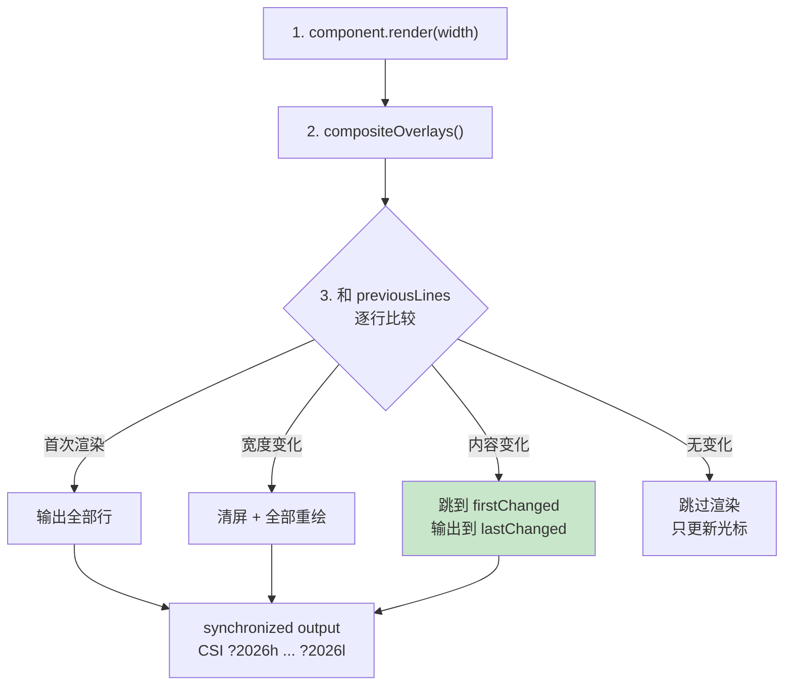

# 第 24 章：`pi-tui` — 在终端里做应用

> **定位**：本章解析 pi 为什么自建 TUI 框架，以及极简 Component 接口如何撑起复杂交互。
> 前置依赖：第 10 章（Agent 事件订阅）。
> 适用场景：当你想理解终端 UI 的渲染模型，或者想为 pi 的 TUI 添加组件。

## 为什么不用 Ink.js？

Node.js 生态有成熟的终端 UI 框架（Ink.js 基于 React 的声明式模型）。pi 选择自建，原因是 **差分渲染的完全控制权**。

Ink.js 使用 React 的 reconciliation 算法来管理组件树，然后把组件树渲染成终端输出。问题在于：终端不是浏览器 DOM — 你不能"修改一个元素"，你只能覆盖某一行的内容。Ink.js 的抽象层让你无法精确控制"哪些行需要重绘"，导致不必要的全屏刷新。

pi-tui 选择了一个更底层的模型：组件返回字符串数组，TUI 逐行比较新旧输出，只重绘变化的行。

## Component 接口：一个方法定义一切

```typescript
// packages/tui/src/tui.ts:17-41
export interface Component {
  render(width: number): string[];
  handleInput?(data: string): void;
  wantsKeyRelease?: boolean;
  invalidate(): void;
}
```

`render` 返回字符串数组（每个元素是一行）。就是这么简单 — 没有 virtual DOM，没有 JSX，没有 state management。一个组件的全部职责就是：给你一个宽度，你告诉我你要显示什么。

`handleInput` 是可选的 — 只有能接收键盘输入的组件（比如 Editor、SelectList）才需要实现它。参数 `data` 是原始的终端输入序列（可能是单个字符如 `"a"`，也可能是转义序列如 `"\x1b[A"` 表示方向上键）。

`wantsKeyRelease` 控制组件是否接收按键释放事件。这需要 Kitty keyboard protocol 支持（普通终端不区分 keydown 和 keyup）。默认 `false` — 释放事件被 TUI 过滤掉，减少组件需要处理的事件量。

`invalidate()` 通知 TUI 组件需要重绘。调用后 TUI 会在下一个 render cycle 重新调用 `render()`。组件的缓存状态（如果有的话）也应该在 `invalidate()` 中清除。

## Focusable 接口与双层光标模型

```typescript
// packages/tui/src/tui.ts:52-68
export interface Focusable {
  focused: boolean;
}

export const CURSOR_MARKER = "\x1b_pi:c\x07";
```

`Focusable` 是 `Component` 的增强接口。当一个组件获得焦点时，TUI 设置它的 `focused` 属性为 `true`。

这里容易产生一个误解：以为终端里只有终端硬件光标这一个光标。pi 实际上用了**两层光标**，各司其职。

**第一层：反色软件光标（用户看到的那个）。** 编辑器并不依赖硬件光标来"显示"光标位置 —— 它在 `render()` 输出里，把光标所在的那个 grapheme 用反色（SGR `\x1b[7m … \x1b[0m`）画出来；光标停在行尾时则反色一个空格（`packages/tui/src/components/editor.ts:549-564`）。这个反色块才是用户视觉上看到的光标，它随差分渲染一起刷新，不受终端硬件光标能力差异的影响。

**第二层：硬件光标（IME 定位叠加层）。** 组件在反色块之前，还会在同一位置输出一个零宽的 `CURSOR_MARKER`（`editor.ts:549-550`）。`CURSOR_MARKER` 是一个 APC（Application Program Command）转义序列 —— 终端会忽略它，但 TUI 渲染后能找到它的位置，把真正的硬件光标移过去。硬件光标在这里几乎不承担"显示"职责，它只是一个**给 IME 用的定位叠加层**：中文、日文、韩文输入法需要读硬件光标位置来放置候选窗口，没有它候选框会飘到错误的地方。

两层分工带来一个必须小心的收尾：**退出时要先清软件光标、再交还硬件光标**。`stop()` 会先写一个普通空格覆盖掉那个反色块（否则退出后终端里会残留一个反色残影），把光标移到内容末尾，最后才 `showCursor()` 恢复正常硬件光标（`tui.ts:698-712`）。v0.81.0 的清屏修复（[#6790](https://github.com/earendil-works/pi/issues/6790)）正是暴露并补上了这个顺序 —— 在此之前退出后会留下一块反色光标残影。

## TUI 类：渲染引擎

```typescript
// packages/tui/src/tui.ts:214-245
export class TUI extends Container {
  public terminal: Terminal;
  private previousLines: string[] = [];
  private previousWidth = 0;
  private previousHeight = 0;
  private focusedComponent: Component | null = null;
  private renderRequested = false;
  private renderTimer: NodeJS.Timeout | undefined;
  private lastRenderAt = 0;
  private static readonly MIN_RENDER_INTERVAL_MS = 16;
  private cursorRow = 0;
  private hardwareCursorRow = 0;
  private maxLinesRendered = 0;
  // Overlay stack for modal components
  private overlayStack: {
    component: Component;
    options?: OverlayOptions;
    preFocus: Component | null;
    hidden: boolean;
    focusOrder: number;
  }[] = [];
}
```

TUI 自身继承了 `Container`（组件树的容器），同时管理渲染状态。几个关键的状态字段：

- `previousLines`：上一次渲染的输出，用于差分比较
- `MIN_RENDER_INTERVAL_MS = 16`：渲染节流，约 60fps 上限，防止高频 invalidate 导致 CPU 空转
- `maxLinesRendered`：终端工作区域的最大高度，用于检测内容收缩时是否需要清理空行

## 渲染调度：requestRender

```typescript
// packages/tui/src/tui.ts:469-516
requestRender(force = false): void {
  if (force) {
    this.previousLines = [];
    this.previousWidth = -1;
    this.previousHeight = -1;
    // ...重置所有状态...
    process.nextTick(() => {
      this.doRender();
    });
    return;
  }
  if (this.renderRequested) return;
  this.renderRequested = true;
  process.nextTick(() => this.scheduleRender());
}

private scheduleRender(): void {
  const elapsed = performance.now() - this.lastRenderAt;
  const delay = Math.max(0, MIN_RENDER_INTERVAL_MS - elapsed);
  this.renderTimer = setTimeout(() => {
    this.doRender();
  }, delay);
}
```

`requestRender` 有两种模式：

- **`force = true`**：清空所有缓存，下一个 tick 立即全量渲染。用于主题切换、终端 reset 等场景。
- **`force = false`**（默认）：标记"需要渲染"，通过 `scheduleRender` 节流到至少 16ms 间隔。多次快速的 `requestRender` 调用只会触发一次实际渲染。

`process.nextTick` 确保渲染在当前事件循环结束后执行 — 这让同一个 tick 中的多个状态变更可以合并为一次渲染。

## 差分渲染算法

`doRender()` 是 TUI 的核心。它的逻辑可以分为四个阶段：



差分阶段的核心代码：

```typescript
// packages/tui/src/tui.ts:981-1011
// Find first and last changed lines
let firstChanged = -1;
let lastChanged = -1;
const maxLines = Math.max(
  newLines.length, this.previousLines.length
);
for (let i = 0; i < maxLines; i++) {
  const oldLine = this.previousLines[i] ?? "";
  const newLine = newLines[i] ?? "";
  if (oldLine !== newLine) {
    if (firstChanged === -1) firstChanged = i;
    lastChanged = i;
  }
}
```

算法的关键洞察：只需要找到**第一个**和**最后一个**变化行。然后把光标移到第一个变化行，从那里开始输出到最后一个变化行。不需要逐行比较和逐行更新 — 因为终端的 cursor movement 本身也有开销，连续输出比跳跃输出更快。

特殊情况处理：

- **宽度变化**：必须全量重绘，因为换行位置全部改变
- **高度变化**：全量重绘（Termux 例外 — 软键盘弹出会频繁改变高度）
- **内容收缩**：可选地清理空行（`clearOnShrink`），避免在长输出消失后留下视觉残留

## Synchronized Output

每次渲染都包裹在 synchronized output 序列中：

```typescript
// packages/tui/src/tui.ts:917-923
let buffer = "\x1b[?2026h"; // Begin synchronized output
// ...写入所有行...
buffer += "\x1b[?2026l"; // End synchronized output
this.terminal.write(buffer);
```

CSI `?2026h` 告诉终端"开始缓冲"，`?2026l` 告诉终端"一次性显示"。没有这个序列，逐行输出会导致可见的闪烁 — 用户能看到旧内容被逐行替换为新内容的过程。synchronized output 让更新在视觉上是原子的。

注意：不是所有终端都支持 CSI 2026。不支持的终端会忽略这些序列，退化为逐行更新。这种优雅降级是 pi-tui 的设计哲学之一 — 利用先进终端的能力，但不依赖它们。

## Overlay 系统

```typescript
// packages/tui/src/tui.ts:119-155
export interface OverlayOptions {
  width?: SizeValue;
  minWidth?: number;
  maxHeight?: SizeValue;
  anchor?: OverlayAnchor;
  offsetX?: number;
  offsetY?: number;
  row?: SizeValue;
  col?: SizeValue;
  margin?: OverlayMargin | number;
  visible?: (termWidth: number, termHeight: number) => boolean;
  nonCapturing?: boolean;
}
```

Overlay 是渲染在主内容之上的浮动组件。典型用途：自动补全菜单、模型选择器、键绑定帮助。

Overlay 的定位支持三种模式：

1. **锚点模式**（`anchor`）：9 个预定义位置（center、top-left、bottom-right 等）
2. **百分比模式**（`row: "25%"`）：相对终端大小定位
3. **绝对模式**（`row: 5, col: 10`）：固定位置

`visible` 回调让 overlay 可以根据终端尺寸动态显示/隐藏 — 比如在终端宽度小于 60 列时隐藏侧边栏 overlay。

Overlay 有独立的焦点管理。`showOverlay` 返回一个 `OverlayHandle`，可以控制显示/隐藏、焦点获取/释放。焦点释放时自动恢复到之前的焦点组件（`preFocus`）。

Overlay 的渲染发生在 `compositeOverlays` 阶段 — 先渲染主内容，再把 overlay 的输出合成到对应位置。差分比较在合成之后进行，所以 overlay 的变化也受益于差分渲染。

## Container：组件树的基础

```typescript
// packages/tui/src/tui.ts:256-289
export class Container implements Component {
  children: Component[] = [];

  addChild(component: Component): void {
    this.children.push(component);
  }

  render(width: number): string[] {
    const lines: string[] = [];
    for (const child of this.children) {
      const childLines = child.render(width);
      for (const line of childLines) {
        lines.push(line);
      }
    }
    return lines;
  }
}
```

Container 是组件树的容器节点。它的 `render` 简单地拼接所有子组件的输出。TUI 自身继承 Container — 整个 UI 就是一棵组件树，TUI 是根节点。

注意内层这个看似啰嗦的 `for...push(line)` 循环 — 它曾经是更简洁的 `lines.push(...child.render(width))`。区别在于 spread 形式会把整个子数组作为函数参数展开，当一个长会话累积出成千上万行、子组件层层嵌套时，`push(...hugeArray)` 会触碰 V8 的参数数量上限，抛出 `RangeError: Maximum call stack size exceeded`（[#2651](https://github.com/earendil-works/pi/issues/2651)，v0.67.0 修复）。逐行 push 没有这个隐患。这是"终端 UI 看似简单、实则处处是规模边界"的一个缩影。

这个设计的简洁性值得注意：没有 layout engine，没有 flex/grid，没有 padding/margin。所有布局都由组件自己在 `render()` 中通过字符串拼接实现。这看起来原始，但对终端 UI 来说足够了 — 终端的布局模型本质上就是"一行一行堆叠"。

## 终端能力检测：探测，而不是假设

"利用先进终端能力但不依赖它们"这条哲学，落地为一套**主动探测**机制 —— TUI 不假设终端支持什么，而是去问。

最典型的是**亮/暗配色检测**。pi 的自动主题需要知道终端背景是亮是暗，但终端不会主动上报。TUI 用 OSC 11 序列查询背景色：

```typescript
// packages/tui/src/tui.ts:1693
queryTerminalColorScheme(
  { timeoutMs }: { timeoutMs: number }
): Promise<TerminalColorScheme | undefined>
```

它向终端写入 OSC 11 查询，终端（如果支持）回写一个 `\x1b]11;rgb:....` 响应，`parseOsc11BackgroundColor` 把它解析成 RGB，再换算成 `"dark" | "light"`（`packages/tui/src/terminal-colors.ts:7,35,67`）。`timeoutMs` 是关键 —— 不支持 OSC 11 的终端永远不回应，所以查询必须带超时，超时即降级为"未知"。

配色还可能在运行中变化（用户切换系统亮暗模式）。TUI 提供订阅接口让上层响应这种变化：

```typescript
// packages/tui/src/tui.ts:660-668
onTerminalColorSchemeChange(
  listener: (scheme: TerminalColorScheme) => void
): () => void
setTerminalColorSchemeNotifications(enabled: boolean): void
```

这套"查询—解析—超时降级—订阅变化"的模式，正是 pi-tui 处理一切高级终端能力的范式。

## Kitty 图片协议：在终端里画图

第 24 章前面提到的 Kitty **keyboard** protocol（区分 keydown/keyup）只是 Kitty 系列协议之一。另一条独立的能力是 Kitty **graphics**（图片）协议 —— 让终端直接渲染位图，pi 用它在对话里内联显示图片附件。

`detectCapabilities()` 返回每个终端支持哪种图片协议：

```typescript
// packages/tui/src/terminal-image.ts:3-9,65
export type ImageProtocol = "kitty" | "iterm2" | null;

export interface TerminalCapabilities {
  images: ImageProtocol;
  trueColor: boolean;
  hyperlinks: boolean;
}

export function detectCapabilities(...): TerminalCapabilities
```

检测逻辑是一串终端识别：Kitty、WezTerm、Ghostty 走 `"kitty"`；Warp 也支持 Kitty graphics 协议（[#5841](https://github.com/earendil-works/pi/issues/5841)，`terminal-image.ts:95-97`）；iTerm2 走 `"iterm2"`；其余返回 `null`（纯文本降级，显示占位符而非图片）。一个重要的保守决策：**tmux 下图片协议不可靠，直接置 `images: null`**（`terminal-image.ts:73-75`）—— 宁可不画，也不画错。

`ImageRenderOptions` 还支持 `imageId`（复用/替换同一张图，避免重复传输）等细节。但设计要点始终一致：能力是探测出来的，不支持就优雅降级到文本。

## 文本渲染的边界细节

自建渲染的代价，是连"把文本正确地铺到终端上"这种小事都得自己兜底。几个 v0.8x 期间补上的细节值得一提：

- **ANSI 感知换行**。`wrapTextWithAnsi()` 按 `\r\n | \r | \n` 统一识别 CRLF/CR/LF 三种换行，并用一个 `AnsiCodeTracker` 跨行追踪 SGR 状态 —— 换行后仍处于激活状态的样式会被补写到续行开头，避免颜色/加粗在硬换行处意外中断（`packages/tui/src/utils.ts:715-735`，[#6764](https://github.com/earendil-works/pi/issues/6764)）。
- **Markdown source-preservation 选项族**。`MarkdownOptions` 允许调用方选择"按源码原样保留"而非规范化：除了早先的 `preserveOrderedListMarkers`（保留源列表序号），v0.80.3 新增 `preserveBackslashEscapes`，让被反斜杠转义的标点原样保留、不被渲染器吃掉（`packages/tui/src/components/markdown.ts:101-102`，[#6105](https://github.com/earendil-works/pi/issues/6105)）。
- **流式代码围栏防闪烁**。流式渲染 Markdown 时，尚未闭合的代码围栏一度会随 token 到达而闪烁、抖动；现在部分闭合的围栏渲染稳定，不再收缩跳变（[#5846](https://github.com/earendil-works/pi/issues/5846)）。

### 得到了什么

**完全的控制力**。差分渲染的粒度、IME 支持（通过 CURSOR_MARKER 定位硬件光标）、Kitty keyboard protocol 支持 — 这些都需要直接操作终端转义序列，框架反而会碍事。

**极低的渲染开销**。字符串比较 + 只重绘变化行的策略，让 TUI 在高频更新场景（比如 bash 命令的流式输出）下保持流畅。

**渲染节流防抖**。16ms 的最小渲染间隔和 `requestRender` 的去重机制，确保即使组件频繁触发 invalidate，CPU 消耗也是可控的。

### 放弃了什么

**更多的维护成本**。从字符宽度计算到 ANSI 转义序列解析，都要自己实现。`visibleWidth()`、`truncateToWidth()`、`wrapTextWithAnsi()` 这些工具函数证明了"终端里的文本处理"远比想象复杂。

**没有声明式 API**。相比 React/Ink.js 的声明式模型，命令式的 `render()` 方法需要组件自己管理所有状态和渲染逻辑。但 Component 接口的简洁性在某种程度上弥补了这一点 — 实现一个新组件只需要一个 `render(width): string[]` 方法。

---

### 版本演化说明
> 本章核心分析基于 pi-mono v0.66.0，已对照 v0.82.1 核实。pi-tui 仍是 pi-mono 中最稳定的包之一：
> Component 接口自创建以来没有改变，新功能通过添加新组件实现。
> Overlay 系统是后来添加的 — 早期版本的模态交互（如模型选择）直接替换主内容。
>
> v0.66 → v0.79 的主要变化：`Container.render` 因长会话栈溢出（#2651，v0.67.0）从 spread-push 改为逐行 push；
> 新增亮/暗配色探测（OSC 11，`terminal-colors.ts`）与运行时订阅；新增 Kitty 图片（graphics）协议及降级（`terminal-image.ts`，Warp 支持见 #5841）；
> 终端能力检测扩展到 OSC 8 超链接、tmux 透传、Windows Terminal/JetBrains 等。运行环境最低 Node 版本提升到 **22.19.0**（v0.75.0，Breaking）。
>
> v0.79 → v0.82 的补充：厘清了**双层光标模型** —— 用户看到的是编辑器渲染的反色软件光标，硬件光标只是 IME 定位叠加层，退出时先清软件光标再恢复硬件光标（#6790）；`wrapTextWithAnsi` 归一化 CRLF/CR 并跨行保留 ANSI 样式（#6764）；Markdown 渲染新增 `preserveBackslashEscapes` 源码保留选项（#6105）、流式代码围栏不再闪烁（#5846）。
