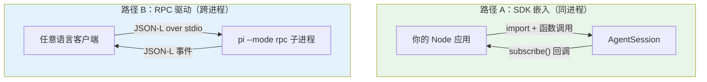

# 第 26b 章：SDK — 把 pi 当库用

> **定位**：本章解析 pi 的 SDK 嵌入路径 —— 不 spawn 子进程，而是直接把 `AgentSession` 嵌入到你自己的 Node 进程里。
> 前置依赖：第 10 章（Agent 类）、第 26 章（RPC 模式）。
> 适用场景：当你想在自己的应用里复用 pi 的 agent 能力（自建 UI、嵌入工作流、构造子 agent），而不是把 pi 当成一个外部命令来驱动。

## 集成 pi 的两条路：驱动 vs 嵌入

第 26 章讲的 RPC 模式是一条集成路径：把 pi 当成一个**外部进程**，用 JSON-L 协议驱动它。这条路的好处是语言无关、进程隔离 —— 任何能读写 stdio 的客户端都能用。但它也有代价：你需要 spawn 一个子进程、序列化每一次调用、跨进程传递事件流。

pi 还提供了第二条路：**SDK 嵌入**。把 `@earendil-works/pi-coding-agent` 当成一个普通的 npm 库 import 进来，在**同一个 Node 进程内**直接构造并操作 `AgentSession`。这是 pi"极简核心、能力外置"哲学的自然延伸 —— 既然 TUI、RPC、mom 都只是同一个内核之上的不同宿主（第 24/26 章），那么没有理由不让外部应用也成为这样一个宿主。



值得注意的是，第 26 章的 RPC 文档甚至**主动建议** Node 用户优先走 SDK：如果你本来就是 Node 进程，直接嵌入 `AgentSession` 比 spawn 一个子进程再隔着 stdio 喊话要简单得多，也省去了 framing、背压、进程生命周期管理这些麻烦。RPC 留给真正需要进程隔离或非 Node 客户端的场景。

## 为什么这很重要

这条嵌入路径背后是一个产品定位的转变：**pi 不只是一个 CLI 应用，它也是一个可嵌入的 agent 库**。这个定位散落在前面好几章的设计细节里，现在可以串起来看：

- 第 12 章里摘要 system prompt 把"AI **coding** assistant"中性化为"AI assistant"，正是为了让压缩内核能被**非编码**的 SDK 调用方复用。
- 第 14/17/19 章反复出现的"去 process-global、cwd 处处显式传入"，正是为了让同一个进程里能并存多个会话、多个工作目录 —— 这是 SDK（尤其是构造子 agent）的前提。
- 第 15 章工具选择改为 `tools: string[]` 名字白名单，让 SDK 调用方能精确声明启用哪些工具。

换句话说，本书前面分析过的许多"看似洁癖"的设计纪律，到了 SDK 这一章才显出它们共同的目的。

## 源码分析：`createAgentSession`

SDK 的主入口是工厂函数 `createAgentSession`（`packages/coding-agent/src/core/sdk.ts:166`）。最小用法只有几行：

```typescript
// docs/sdk.md
import { AuthStorage, createAgentSession, ModelRegistry,
         SessionManager } from "@earendil-works/pi-coding-agent";

const authStorage = AuthStorage.create();
const modelRegistry = ModelRegistry.create(authStorage);

const { session } = await createAgentSession({
  sessionManager: SessionManager.inMemory(),
  authStorage,
  modelRegistry,
});

session.subscribe((event) => {
  if (event.type === "message_update"
      && event.assistantMessageEvent.type === "text_delta") {
    process.stdout.write(event.assistantMessageEvent.delta);
  }
});

await session.prompt("What files are in the current directory?");
```

注意几个设计点：

**1. 全部有默认值，渐进式覆盖**。不传任何参数，`createAgentSession()` 就用 `DefaultResourceLoader` 走标准发现流程、用 `SessionManager.create(cwd)` 落盘会话。需要时再逐项覆盖：

```typescript
// CreateAgentSessionOptions（sdk.ts:55-90 节选）
const { session } = await createAgentSession({
  model: myModel,
  tools: ["read", "bash"],          // 名字白名单（第 19 章）
  excludeTools: ["write"],          // 在白名单之后再排除
  customTools: [myToolDefinition],  // 注册额外的自定义工具
  noTools: "builtin",               // 禁用内建工具但保留扩展工具
  sessionManager: SessionManager.inMemory(),  // 不落盘，纯内存会话
});
```

`SessionManager.inMemory()` 是 SDK 友好的一个细节 —— 测试或一次性任务可以用纯内存会话，不在磁盘上留下 JSONL 文件（对照第 11 章的落盘会话）。

**2. 返回值不止 session**。`createAgentSession` 返回 `{ session, extensionsResult, modelFallbackMessage }`（`CreateAgentSessionResult`）：`extensionsResult` 供宿主在需要时自己搭 UI context，`modelFallbackMessage` 在"恢复的会话所存模型与当前不一致"时给出告警。

**3. `AgentSession` 就是那个有状态壳**。拿到的 `session` 暴露的方法和第 10 章的 Agent、第 26 章的 RPC 命令一一呼应：`prompt()` / `steer()` / `followUp()` / `abort()` / `setModel()` / `compact()` / `getMessages()` / `fork()`，以及 `subscribe(event)` 订阅事件流。RPC 层本质上就是把这些方法序列化成 JSON-L —— SDK 只是把同一组方法**直接**交到你手里。

### 更低层的组合入口

如果默认工厂还不够灵活，SDK 暴露了更细的组合层：`createAgentSessionRuntime`（`agent-session-runtime.ts:406`）、`createAgentSessionServices` / `createAgentSessionFromServices`。它们把"构造依赖（services）"与"用依赖装配 session"拆成两步，便于在多会话宿主里复用同一批 services。大多数调用方用 `createAgentSession` 就够了，这些是为"完全控制"准备的。

### 不只是 session：可复用的构件被导出

SDK 还把一批原本是内部细节的构件提升为公共导出，让宿主不必重新造轮子。例如第 20 章提到的 `generateDiffString` / `generateUnifiedPatch` / `EditDiffResult`、第 26 章的 typed `RpcClient`、图片处理（`convertToPng` / resize）、参数解析 `parseArgs`、`CONFIG_DIR_NAME`、以及包内资源路径 helper。这些导出意味着：你可以只取用 pi 的某个能力（比如生成 unified patch），而不必启动整个 agent。

## 模式提炼

**嵌入 vs 驱动的选择**：

| 维度 | SDK 嵌入（本章） | RPC 驱动（第 26 章） |
|------|------------------|----------------------|
| 进程 | 同进程，直接函数调用 | 子进程，JSON-L over stdio |
| 语言 | 仅 Node/TS | 任意语言 |
| 隔离 | 无（共享进程） | 有（独立进程） |
| 开销 | 低（无序列化、无 framing） | 高（每次调用序列化 + 跨进程） |
| 适用 | Node 应用内嵌、构造子 agent、测试 | IDE 插件、非 Node 客户端、需隔离 |

**经验法则**：你是 Node 进程且不需要进程隔离 → 用 SDK；否则 → 用 RPC。

## 用户能做什么

- **自建 UI**：用 `createAgentSession` + `subscribe` 把事件流接到你自己的 Web/桌面前端，复用 pi 的循环、压缩、工具，而不用 fork pi。
- **构造子 agent**：在一个工具的 `execute` 里再 `createAgentSession`（多用纯内存会话），实现"agent 调 agent"。这正是 subagent 示例扩展的底层做法。
- **只借一个能力**：只想要 unified patch 或图片转换？直接 import 对应导出，不必起 agent。

---

### 版本演化说明
> 本章描述的 SDK 嵌入路径在 v0.66.1（本书基线）尚未作为一等公民成型，是 pi 走向"可嵌入库"定位后逐步固化的，校订至 v0.79.7。关键节点：`createAgentSession` 的 `tools: string[]` 名字白名单（v0.68.0）；工具参数校验切到 `typebox` 1.x，使其在禁用 `eval` 的运行时（如 Cloudflare Workers）也能执行（v0.69.0）；摘要 prompt 中性化以支持非编码复用（v0.79.0）；嵌入时不再强制要求相邻的 package.json 文件（v0.78.1）。`AgentSession` 的方法面与第 10 章 Agent、第 26 章 RPC 命令保持一一对应。
