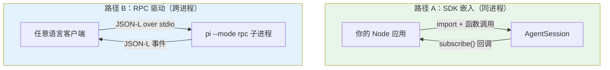

# 第 26b 章：SDK — 把 pi 当库用

> **定位**：本章解析 pi 的 SDK 嵌入路径 —— 不 spawn 子进程，而是直接把 `AgentSession` 嵌入到你自己的 Node 进程里。
> 前置依赖：第 10 章（Agent 类）、第 26 章（RPC 模式）。
> 适用场景：当你想在自己的应用里复用 pi 的 agent 能力（自建 UI、嵌入工作流、构造子 agent），而不是把 pi 当成一个外部命令来驱动。

## 集成 pi 的两条路：驱动 vs 嵌入

第 26 章讲的 RPC 模式是一条集成路径：把 pi 当成一个**外部进程**，用 JSON-L 协议驱动它。这条路的好处是语言无关、进程隔离 —— 任何能读写 stdio 的客户端都能用。但它也有代价：你需要 spawn 一个子进程、序列化每一次调用、跨进程传递事件流。

pi 还提供了第二条路：**SDK 嵌入**。把 `@earendil-works/pi-coding-agent` 当成一个普通的 npm 库 import 进来，在**同一个 Node 进程内**直接构造并操作 `AgentSession`。这是 pi"极简核心、能力外置"哲学的自然延伸 —— 既然 TUI、RPC、mom 都只是同一个内核之上的不同宿主（第 24/26 章），那么没有理由不让外部应用也成为这样一个宿主。



值得注意的是，第 26 章的 RPC 文档甚至**主动建议** Node 用户优先走 SDK：如果你本来就是 Node 进程，直接嵌入 `AgentSession` 比 spawn 一个子进程再隔着 stdio 喊话要简单得多，也省去了 framing、背压、进程生命周期管理这些麻烦。RPC 留给真正需要进程隔离或非 Node 客户端的场景。

## 为什么这很重要

这条嵌入路径背后是一个产品定位的转变：**pi 不只是一个 CLI 应用，它也是一个可嵌入的 agent 库**。这个定位散落在前面好几章的设计细节里，现在可以串起来看：

- 第 12 章里摘要 system prompt 把"AI **coding** assistant"中性化为"AI assistant"，正是为了让压缩内核能被**非编码**的 SDK 调用方复用。
- 第 14/17/19 章反复出现的"去 process-global、cwd 处处显式传入"，正是为了让同一个进程里能并存多个会话、多个工作目录 —— 这是 SDK（尤其是构造子 agent）的前提。
- 第 15 章工具选择改为 `tools: string[]` 名字白名单，让 SDK 调用方能精确声明启用哪些工具。

换句话说，本书前面分析过的许多"看似洁癖"的设计纪律，到了 SDK 这一章才显出它们共同的目的。

## 源码分析：`createAgentSession`

SDK 的主入口是工厂函数 `createAgentSession`（`packages/coding-agent/src/core/sdk.ts:169`）。最小用法只有几行：

```typescript
import { createAgentSession, ModelRuntime,
         SessionManager } from "@earendil-works/pi-coding-agent";

const modelRuntime = await ModelRuntime.create();

const { session } = await createAgentSession({
  sessionManager: SessionManager.inMemory(),
  modelRuntime,
});

session.subscribe((event) => {
  if (event.type === "message_update"
      && event.assistantMessageEvent.type === "text_delta") {
    process.stdout.write(event.assistantMessageEvent.delta);
  }
});

await session.prompt("What files are in the current directory?");
```

> **Breaking（v0.80.8）**：这段最小示例在旧版本里是 `AuthStorage.create()` + `ModelRegistry.create(authStorage)` 两件套传入 `createAgentSession`。现在 `CreateAgentSessionOptions` 的模型/认证入口**只剩一个异步的 `modelRuntime?: ModelRuntime`**（`sdk.ts:45`）；`authStorage` / `modelRegistry` 选项已移除。`ModelRuntime.create()` 内部会用 `agentDir/auth.json` + `models.json` 装配好凭证、内建目录、动态目录（第 18 章）。连 `modelRuntime` 都可以省略 —— 不传时 `createAgentSession` 自己 `await ModelRuntime.create({…})`（`sdk.ts:176`）。相应地，`AuthStorage` 及其后端**不再从包根导出**；若只想读一条已存凭证，用 `readStoredCredential()`（`index.ts:26`），或直接用 `ModelRuntime`（也可用 pi-ai 的 `CredentialStore`，见第 4-7 章认证子系统）。

注意几个设计点：

**1. 全部有默认值，渐进式覆盖**。不传任何参数，`createAgentSession()` 就用 `DefaultResourceLoader` 走标准发现流程、用 `SessionManager.create(cwd)` 落盘会话。需要时再逐项覆盖：

```typescript
// CreateAgentSessionOptions（sdk.ts:37-86 节选）
const { session } = await createAgentSession({
  model: myModel,
  tools: ["read", "bash"],          // 名字白名单（第 19 章）
  excludeTools: ["write"],          // 在白名单之后再排除
  customTools: [myToolDefinition],  // 注册额外的自定义工具
  noTools: "builtin",               // 禁用内建工具但保留扩展工具
  sessionManager: SessionManager.inMemory(),  // 不落盘，纯内存会话
});
```

`SessionManager.inMemory()` 是 SDK 友好的一个细节 —— 测试或一次性任务可以用纯内存会话，不在磁盘上留下 JSONL 文件（对照第 11 章的落盘会话）。

**2. 返回值不止 session**。`createAgentSession` 返回 `{ session, extensionsResult, modelFallbackMessage }`（`CreateAgentSessionResult`）：`extensionsResult` 供宿主在需要时自己搭 UI context，`modelFallbackMessage` 在"恢复的会话所存模型与当前不一致"时给出告警。

**3. `AgentSession` 就是那个有状态壳**。拿到的 `session` 暴露的方法和第 10 章的 Agent、第 26 章的 RPC 命令一一呼应：`prompt()` / `steer()` / `followUp()` / `abort()` / `setModel()` / `compact()` / `getMessages()` / `fork()`，以及 `subscribe(event)` 订阅事件流。RPC 层本质上就是把这些方法序列化成 JSON-L —— SDK 只是把同一组方法**直接**交到你手里。

### 更低层的组合入口

如果默认工厂还不够灵活，SDK 暴露了更细的组合层：`createAgentSessionRuntime`（`agent-session-runtime.ts:406`）、`createAgentSessionServices` / `createAgentSessionFromServices`。它们把"构造依赖（services）"与"用依赖装配 session"拆成两步，便于在多会话宿主里复用同一批 services。大多数调用方用 `createAgentSession` 就够了，这些是为"完全控制"准备的。

### 不只是 session：可复用的构件被导出

SDK 还把一批原本是内部细节的构件提升为公共导出，让宿主不必重新造轮子。例如第 20 章提到的 `generateDiffString` / `generateUnifiedPatch` / `EditDiffResult`、第 26 章的 typed `RpcClient`、图片处理（`convertToPng` / resize）、参数解析 `parseArgs`、`CONFIG_DIR_NAME`、以及包内资源路径 helper。这些导出意味着：你可以只取用 pi 的某个能力（比如生成 unified patch），而不必启动整个 agent。

本区间新增/提升的公共导出还包括：

- **`ModelRuntime`**（`index.ts:180`）—— 如上文，模型/认证的规范门面；`ModelRegistry` 仍导出（`index.ts:169`）但仅作 extension 用的同步 compat 投影。
- **`InlineExtension`**（`index.ts:96`）—— 让宿主**内联**声明一个 extension（直接给对象，而非指向磁盘上的 extension 文件路径），SDK 场景下无需为一个临时 hook 单独建文件。
- **消息与工具执行的生命周期事件类型**（如 `message_end`、工具执行的 start/update/end 事件类型），让 TypeScript 宿主能类型安全地 `subscribe` 并 narrow 事件。
- **`JsonlSessionStorage` / `InMemorySessionStorage`**（可插拔存储后端，第 11 章）—— 宿主可自带存储实现，或在 `SessionManager` 之外直接用它们控制会话怎么落盘。
- **CLI 等价的 model 解析** helper —— 把用户在命令行写的 `provider/model:thinking` 串解析成 `Model` 对象，让 SDK 宿主复用与 CLI 完全一致的选模型语义。

## 第二消费者：evals harness

SDK 有没有真实的第二消费者，是检验"可嵌入库"定位是否成立的试金石 —— 如果只有 pi 自己的 CLI 用 `createAgentSession`，那这套嵌入 API 很容易在演进中悄悄退化。本区间新增的私有包 `packages/evals`（pi-evals，不发布）正是这样一个消费者：它是一套基于 `vitest-evals` 的评测 harness，用 `createHarness` 驱动**真实的** `createAgentSession`，在临时 workspace 里跑任务、汇报最终消息 / transcript / token usage。

```typescript
// file: packages/evals/src/pi-harness.ts:4-11（节选重排）
import {
  createAgentSession, DefaultResourceLoader,
  ModelRuntime, SessionManager, SettingsManager,
} from "@earendil-works/pi-coding-agent";
import { createHarness } from "vitest-evals/harness";
```

它的 import 面把本章讲的构件都串了起来：`ModelRuntime`（上文的规范门面）、`DefaultResourceLoader`、`SessionManager`、`SettingsManager`。harness 从环境变量 `PI_PROVIDER` / `PI_MODEL` 读出要评测的模型（`getRequiredModelSelection()`），装配一个真实 session 跑完再 dispose、清理临时目录。

这个消费者有两层意义。其一，它是 SDK 面的**回归护栏** —— evals 每次运行都在走真实的嵌入路径，`createAgentSession` 的签名一旦破坏就会立刻暴露。其二，它把两个看似无关的特性连了起来：evals 依赖 `PI_PROVIDER` / `PI_MODEL` 这两个**会话环境变量**（第 22 章）来选模型，而这些变量本身是 bash 工具注入子进程的会话上下文的一部分。换句话说，"SDK 嵌入"（本章）和"bash 会话环境变量"（第 22 章）在 evals harness 这里第一次同时落地成一个真实用例。

## 模式提炼

**嵌入 vs 驱动的选择**：

| 维度 | SDK 嵌入（本章） | RPC 驱动（第 26 章） |
|------|------------------|----------------------|
| 进程 | 同进程，直接函数调用 | 子进程，JSON-L over stdio |
| 语言 | 仅 Node/TS | 任意语言 |
| 隔离 | 无（共享进程） | 有（独立进程） |
| 开销 | 低（无序列化、无 framing） | 高（每次调用序列化 + 跨进程） |
| 适用 | Node 应用内嵌、构造子 agent、测试 | IDE 插件、非 Node 客户端、需隔离 |

**经验法则**：你是 Node 进程且不需要进程隔离 → 用 SDK；否则 → 用 RPC。

## 用户能做什么

- **自建 UI**：用 `createAgentSession` + `subscribe` 把事件流接到你自己的 Web/桌面前端，复用 pi 的循环、压缩、工具，而不用 fork pi。
- **构造子 agent**：在一个工具的 `execute` 里再 `createAgentSession`（多用纯内存会话），实现"agent 调 agent"。这正是 subagent 示例扩展的底层做法。
- **只借一个能力**：只想要 unified patch 或图片转换？直接 import 对应导出，不必起 agent。

---

### 版本演化说明
> 本章描述的 SDK 嵌入路径在 v0.66.1（本书基线）尚未作为一等公民成型，是 pi 走向"可嵌入库"定位后逐步固化的，已对照 **v0.82.1**。
> 本区间最重要的是一处 **Breaking（v0.80.8）**：`CreateAgentSessionOptions` 移除 `authStorage` / `modelRegistry`，改为单一异步入口 `modelRuntime?: ModelRuntime`（`sdk.ts:45`）；`AuthStorage` 不再从包根导出，读凭证改用 `readStoredCredential()`（`index.ts:26`）或 `ModelRuntime`（第 18 章）。最小示例已相应重写为 `ModelRuntime.create()` + `modelRuntime`。
> 新导出面：`ModelRuntime`（`index.ts:180`）、`InlineExtension`（`index.ts:96`）、消息/工具执行生命周期事件类型、`JsonlSessionStorage` / `InMemorySessionStorage`、CLI 等价 model 解析。
> 新增真实第二消费者 `packages/evals`（pi-evals，`createHarness` 驱动真实 `createAgentSession`，依赖 `PI_PROVIDER`/`PI_MODEL`），既是 SDK 面回归护栏，也串起第 22 章的会话环境变量。
> 更早的关键节点仍成立：`tools: string[]` 名字白名单（v0.68.0）；工具参数校验切到 `typebox` 1.x（v0.69.0）；摘要 prompt 中性化以支持非编码复用（v0.79.0）；嵌入时不再强制相邻 package.json（v0.78.1）。`AgentSession` 的方法面与第 10 章 Agent、第 26 章 RPC 命令保持一一对应。
